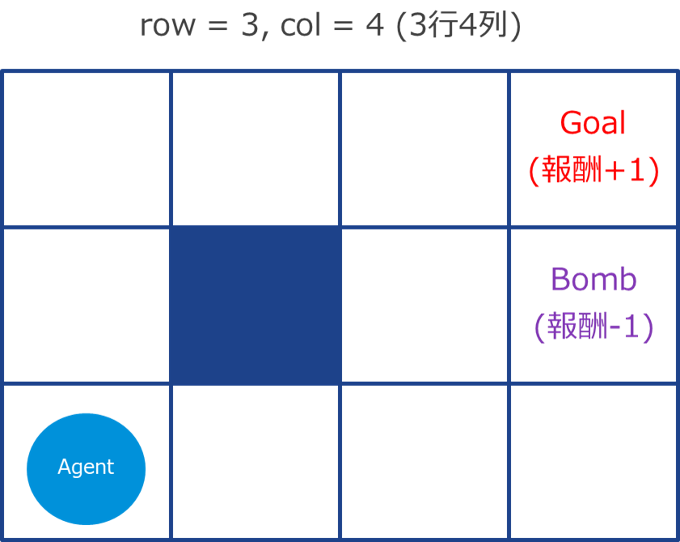
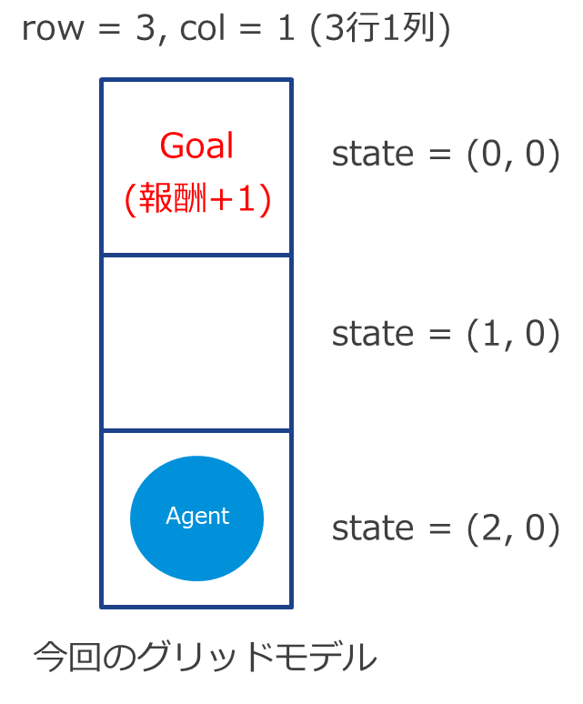
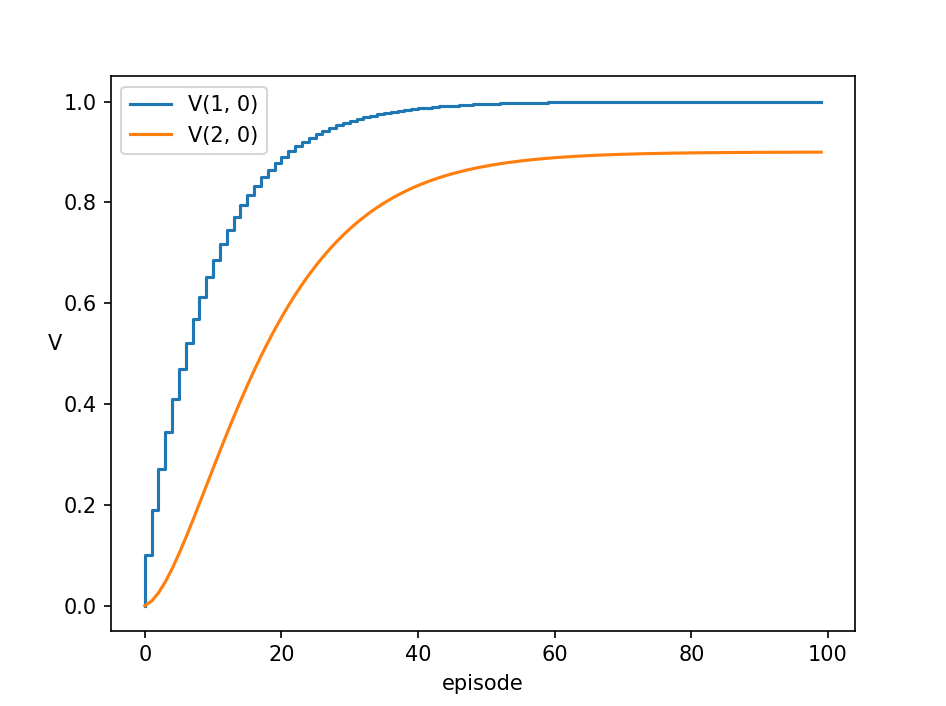
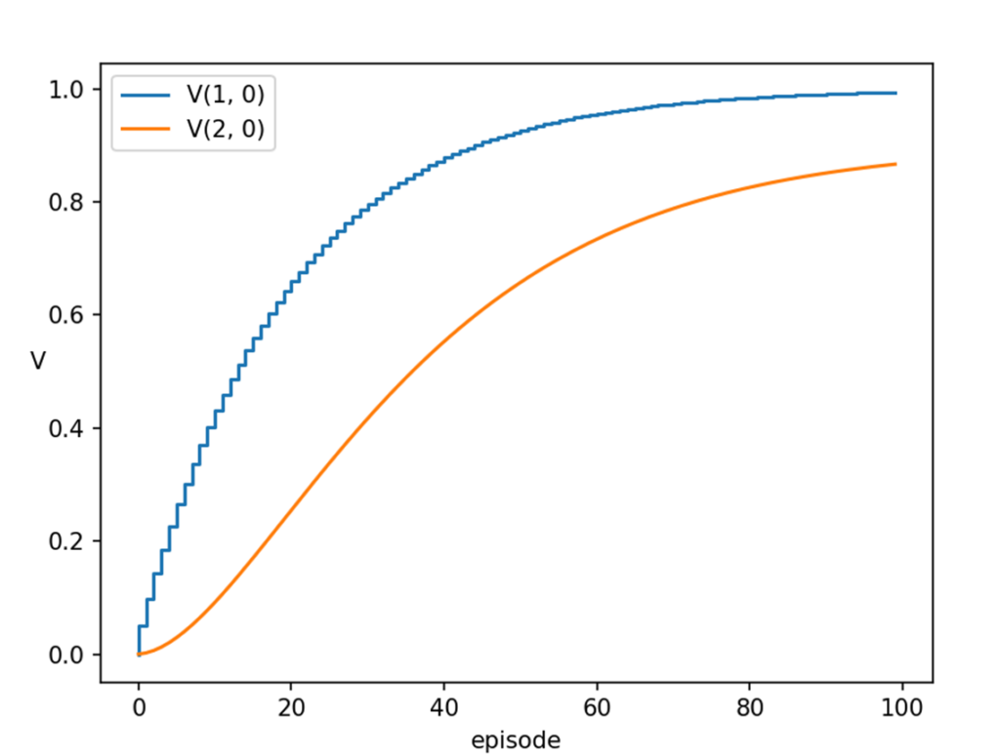
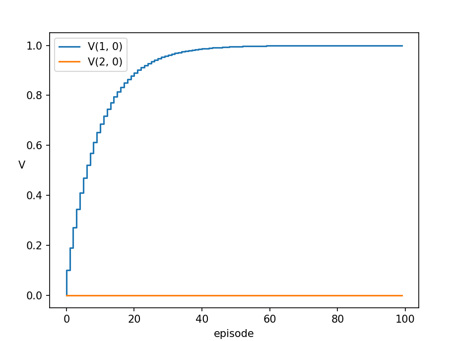
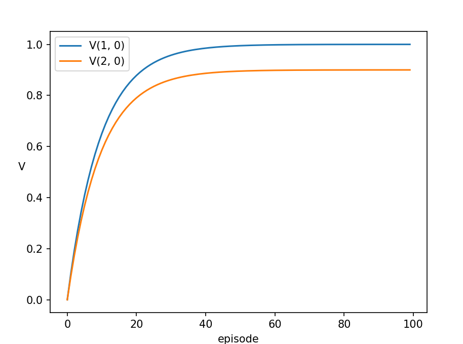

**最近、プライベートで一番話す相手がChatGPT になるくらいにはChatGPT にドハマりしており**（ちなみに二番目は近所のスーパーの店員に対する「ポイントカード持ってないです」）、重い腰を上げて本格的に機械学習を勉強し始めたところ、これが中々面白いです。何よりChatGPT のおかげで勉強効率が上がったこともあって、今のところモチベーション高く進められているので、（もはやVMware 関係ないですが）私のように全く機械学習のバックグラウンドがない人向けに何か参考になればと思い、今のうちにブログに残しておこうと思いました。

さて、今回の記事のトピックは主にTD (Temporal Difference) 法です。参考書の中でTD 法の解説が少なかったのと、自分がキャッチアップするのに時間がかかったため、モンテカルロ法と比較しながら取り上げたいと思いました。

本記事の前提として、ベルマン方程式の導出は理解しておいた方がよいです。ベルマン方程式は解説記事がたくさんあるのと、上記参考書にも丁寧に導出されている強化学習の基本の考えなので、時間をかけてでもキャッチアップする価値はあると思います。

Python の知識はほとんど必要ないです。登場するコードはすべてPython ですが、今はGithub Copilot とChatGPT (もちろんGPT-4) のおかげで知らなくても大体コードは書けますし、わからないコードの部分の解説もしてくれるので、分からなければAI （とお金）で解決しましょう。実際私は勉強を始めるにあたりPython のコードをほとんど書いたことがありませんでしたが、なんとかなってます。

## 問題設定

あなたは今あるグリッドモデルに迷い込んだエージェントとします。グリッドの中をさまよい、ゴールにたどり着いたら1 ポイントの報酬を貰えるとします。また、グリッドモデルには地雷が埋まっている場合があり、踏んでしまったら1 ポイント報酬が減ります。最も報酬を手に入れられる最適な経路はどのような経路でしょうか？

<figure>



<figcaption>

参考書のグリッドモデル

</figcaption>

</figure>

例えば図のグリッドモデルの場合、左下のエージェントは地雷を避けながらゴールに行けばOK です。↑、↑、→、→、→ のような経路もあれば、→、→、↑、↑、→ といった経路もあります（青いグリッドは壁）。これはグリッドモデルが既知なのですぐにわかりますが、これが全く分からない場合、つまりゴールも地雷も分からない場合は、実際に移動してみればわかります。つまり、エージェントであるあなたは、真っ暗闇の中とにかく右へ左へ上へ下へと移動してみて、時には壁にぶつかり、時には地雷を踏み、とにかく試行し、右上にゴールがあること、ゴールの下のグリッドに地雷が埋まっていることを経験で判断できるようになります。これがいわゆるモンテカルロ法です。

モンテカルロ法から最適経路を求めるために、各グリッドにおける状態価値関数が重要になってきます。状態価値関数とは、ある状態に置ける報酬の期待値であり（ベルマン方程式を理解していないとこの辺から辛くなってくるのですが）、**すごーく雑な言い方とすると、状態価値関数とはお宝のにおいみたいなものです。**

<figure>


<figcaption>

モンテカルロ法は歩き回ってお宝がありそうなお得な道筋を探すイメージ （画像はAI で作成した宝探しのイメージ図です）

</figcaption>

</figure>

ある状態、この問題設定であればグリッドごとに、報酬の期待値が良いグリッドと、逆に報酬の期待値が悪いグリッドがあります。例えば参考書のモデルであれば、Bomb の下のグリッドにエージェントがいると、↑に移動すれば-1 の報酬なので、なんとなく悪いグリッドと直感的にわかります。逆にGoal の左隣りのグリッドであれば、右に移動すれば報酬が貰えてすぐにゴールできるので、良いグリッドと直感的にわかります。この良いグリッドを数値的に表現したものが状態価値関数であり、将来的にもらえる報酬の期待値を意味し、状態価値関数をもとに最適な経路を探すことができます。

ということで、最適経路を求める問題は状態価値関数を求めることに帰着するのですが、この状態価値観数を求めるモンテカルロ法以外の1つの手法として、TD 法があります。

## TD 法とは？

TD 法（Temporal Difference learning）は、エピソード（スタートからゴールまでの一連の流れ。モンテカルロ法のような探索では、エピソードごとに試行する経路にばらつきがあるため、それを平準化するためにたくさんのエピソードを試行します）が終了する前に、途中で得られる報酬と状態価値関数の差（Temporal Difference）を用いて価値関数を更新する手法です。つまり、エージェントはゴールに到達する前に、途中の状態における報酬の予測値を更新して学習を進めていきます。

一方モンテカルロ法では、エピソードが終了してから価値関数を更新します。両者の違いとして、例えば試験対策の10年分の過去問を解くことを考えてみます。人によってやり方は色々あると思いますが、モンテカルロ法の場合は、1年分を解いたら、答え合わせをして、勉強していくイメージです。TD 法は1問ごとに答え合わせをして勉強していくイメージです（例えが悪い？？）。TD 法の方がより頻繁に学習と行動の見直しをしていくというわけです。

ということでここから数式とコードです。

## TD 法を手計算する



超シンプルな図の一次元グリッドモデルで考えます。地雷もなく、エージェントは上にしか進みません（下にも進みませんし、壁にもぶつかりません）。つまりこの時点で最適経路は↑、↑ で確定し、もらえる報酬も理論的には1 で確定なのですが、TD 法やモンテカルロ法はあくまでも推測なので、理論値が出るとは限りません。ということで、計算してみましょう。

TD 法の計算式は以下の通りです。

\[latex\] V(s\_t) \\leftarrow V(s\_t) + \\alpha \\left\[ r\_{t+1} + \\gamma V(s\_{t+1}) - V(s\_t) \\right\]\[/latex\]

\[latex\]s\_{t}\[/latex\] はあるタイムステップの状態であり、ここではグリッドの座標になります。\[latex\]V(s\_{t})\[/latex\] はある状態における価値関数で、初期値は0 です（これをTD 法で最適な価値関数に近づけていきます）。\[latex\]r\_{t+1}\[/latex\] はタイムステップ\[latex\]t+1 \[/latex\]の報酬、つまりエージェントが上に移動したときの報酬です（参考書のグリッドモデルでは上下左右に確率的に動きますが、ここでは上にのみ移動します）。\[latex\]\\alpha\[/latex\] は学習率、つまり価値関数の更新速度を意味し、\[latex\]\\gamma\[/latex\] は割引係数で、将来の報酬をどれだけ重視するかを決めます。それぞれ初期値は0.1, 0.9 とします。両者のパラメータの登場は唐突ですが、この後もう少し説明します。

また、\[latex\]t = r\_{t+1} + \\gamma V(s\_{t+1}) \[/latex\] (t=target)とおくと、上記の式は以下のように書けます。

\[latex\]V(s\_t) \\leftarrow V(s\_t) + \\alpha \\left\[t - V(s\_t) \\right\]\[/latex\]

また、表記上、あるグリッド座標\[latex\](x, y)\[/latex\]における価値関数\[latex\]V\[/latex\] を\[latex\]V\_{(x, y)}\[/latex\] のように表現することにします。同様に報酬も\[latex\]r\_{(x, y)}\[/latex\] と表します。

### 1回目の試行（episode=1）

**\[latex\]s\_{1} = (0, 0)\[/latex\] のとき**

\[latex\](0, 0)\[/latex\] はゴールです。ゴールにおける価値関数は0 です。なぜならば、報酬はあくまでもゴールにたどり着いたときに貰えるものであり、また、ゴール上にエージェントがたどり着いたらエピソードが終了されるためです。繰り返しですが、価値関数とは将来的にもらえる報酬の期待値です。ゴールにいたとしても報酬はもらえないので、当然価値関数も0 とすべきです。

**\[latex\]s\_{1} = (2, 0)\[/latex\] のとき (エージェントの初期位置)**

次のステップでは\[latex\]S\_{2} = (1, 0)\[/latex\] に移動しますが、この時の報酬\[latex\]r\_{(1,0)}\[/latex\] は0 です。報酬が貰えるのはゴールである\[latex\](0, 0)\[/latex\] にたどり着いた時のみです。\[latex\]V\[/latex\] の初期値は0 なので、\[latex\]V\_{(1, 0)}\[/latex\], \[latex\]V\_{(2, 0)}\[/latex\] ともに0 です。

\[latex\]V\_{(2, 0)} = V\_{(2, 0)} + \\alpha \\left\[ r\_{(1, 0)} + \\gamma V\_{(1, 0)} - V\_{(2, 0)} \\right\] = 0 + 0.1 \* (0 + 0.9 \* 0 - 0) = 0\[/latex\]

**\[latex\]s\_{1} = (1, 0)\[/latex\] のとき**

次のステップではゴールである\[latex\](0, 0)\[/latex\] に移動し、この時の報酬\[latex\]r\_{(0, 0)}\[/latex\] は1 です。\[latex\]V\[/latex\] の初期値は0 なので、\[latex\]V\_{(1, 0)}\[/latex\] は0 であり、\[latex\]V\_{(0, 0)}\[/latex\] も上述したように0 となります。

\[latex\]V\_{(1, 0)} = V\_{(1, 0)} + \\alpha \\left\[ r\_{(0,0)} + \\gamma V\_{(0, 0)} - V\_{(1, 0)} \\right\] = 0 + 0.1 \* (1 + 0.9 \* 0 - 0) = 0.1\[/latex\]

### 2回目の試行（episode=2）

**\[latex\]s\_{2} = (0, 0)\[/latex\] のとき**

同様に\[latex\]V = 0\[/latex\] です。

**\[latex\]s\_{2} = (2, 0)\[/latex\] のとき (エージェントの初期位置)**

\[latex\]V\_{(2, 0)} = V\_{(2, 0)} + \\alpha \\left\[ r\_{(1, 0)} + \\gamma V\_{(1, 0)} - V\_{(2, 0)} \\right\] = 0 + 0.1 \* (0 + 0.9 \* 0.1 - 0) = 0.009\[/latex\]

**\[latex\]s\_{2} = (1, 0)\[/latex\] のとき**

\[latex\]V\_{(1, 0)} = V\_{(1, 0)} + \\alpha \\left\[ r\_{(0,0)} + \\gamma V\_{(0, 0)} - V\_{(1, 0)} \\right\] = 0.1 + 0.1 \* (1 + 0.9 \* 0 - 0.1) = 0.19\[/latex\]

### 3回目の試行 (episode=3)

\[latex\]V\_{(2, 0)} = 0.009 + 0.1 \* (0.9 \* 0.19 -0.009) = 0.0252\[/latex\]

\[latex\]V\_{(1, 0)} = 0.19 + 0.1 \* (1 - 0.19) =0.271\[/latex\]

こんな感じで試行を進めていくと、各グリッドの価値関数はグラフのようになります。つまり、\[latex\]V\_{(1, 0)}\[/latex\] は1.0 に近づき、\[latex\]V\_{(2, 0)}\[/latex\] は割引係数\[latex\]\\gamma = 0.9 \[/latex\] に近づいていきます。

<figure>



<figcaption>

α = 0.1, γ = 0.9 の場合

</figcaption>

</figure>

もう一度価値関数の更新式を見てみましょう。

\[latex\] V(s\_t) \\leftarrow V(s\_t) + \\alpha \\left\[ r\_{t+1} + \\gamma V(s\_{t+1}) - V(s\_t) \\right\]\[/latex\]

\[latex\]\\alpha\[/latex\] は、漸化式の前の値に対して、\[latex\] \\left\[ r\_{t+1} + \\gamma V(s\_{t+1}) - V(s\_t) \\right\]\[/latex\] という次の状態の情報に基づく値をどれだけ加えるか、という割合です。もっとわかりやすく言うと、別のグリッドの将来的に得られる報酬の期待値（＝お宝のにおいの濃さ）を使って、妥当な解に近づけている時の、その近づける割合になります（＝どれだけそのお宝のにおいを信じるか）。これが学習率と言われるゆえんです。\[latex\]\\alpha\[/latex\] が大きければ、グラフはより急に、小さければより緩やかに収束値に向かいます。\[latex\]\\alpha\[/latex\] を価値関数の更新速度と先に表現しましたが、そのイメージがより理解しやすくなったでしょうか。

<figure>



<figcaption>

α = 0.05 , γ = 0.9 の場合

</figcaption>

</figure>

\[latex\]\\gamma\[/latex\] は割引係数と表現しましたが、 \[latex\]\\gamma\[/latex\] が1に近いほど、エージェントは将来の報酬を重視し、長期的な報酬を最適化しようとします。つまり、次の状態のお宝のにおいの値に対して、どれほどそれを信用するか、という割合です。\[latex\]\\gamma\[/latex\] がもし 0 であれば、\[latex\]V(s\_{t+1})\[/latex\] の値を全く使わないことになるので、それはつまり現在の状態から次に移動したときの報酬の値\[latex\]r\_{t+1}\[/latex\]しか信用しないことになります。今回の3 × 1 グリッドモデルでは、\[latex\]s = (1, 0)\[/latex\] のときは↑に移動すると報酬が貰えるので価値関数\[latex\]V\_{(1, 0)}\[/latex\]は1に近づきますが、\[latex\]s = (2, 0)\[/latex\] では↑に移動しても報酬は貰えませんので、価値関数\[latex\]V\_{(2, 0)}\[/latex\] は常に0 となります。

<figure>



<figcaption>

α = 0.1 , γ = 0 の場合

</figcaption>

</figure>

## モンテカルロ法の場合

では、モンテカルロ法の場合はどうなるでしょうか？TD 法よりも考え方はシンプルです。価値関数\[latex\]V\[/latex\] は将来に得られる報酬の期待値でした。モンテカルロ法では、試行回数を増やし、報酬がどれだけ貰えるかを記録し、その値をもとに期待値を計算します。数式としては以下のようになります。

\[latex\] V(s\_{t}) \\leftarrow V(s\_{t}) + \\alpha \\left\[ G\_{t} - V(s) \\right\]\[/latex\]

G は報酬の合計ですが、近い将来の報酬の値をより重視するために、TD 法と同様割引係数\[latex\]\\gamma \[/latex\] を掛けています。

\[latex\]G\_{t} = R\_{t} + \\gamma R\_{t+1} + \\gamma^2 R\_{t+2} ... = R\_{t} + \\gamma G\_{t+1}\[/latex\]

上記の式でなぜ期待値を計算できるかぱっとは分かりづらいですが、細かい話をここでは説明しきれないので、ChatGPT に聞くか参考書を買って読んでください。重要なのはTD 法との違いを認識することです。

### モンテカルロ法を手計算する

### 1回目の試行（episode=1）

**\[latex\]s\_{1} = (0, 0)\[/latex\] のとき**

\[latex\](0, 0)\[/latex\] はゴールです。ゴールにおける価値関数は0 です。

**\[latex\]s\_{1} = (1, 0)\[/latex\] のとき**

G はある状態において将来的に得られるであろう報酬の合計を表します。次のタイミングで上に移動したらすぐに報酬が貰えてゴールするので、\[latex\]s = (1, 0)\[/latex\] のとき常にG=1 なのは直感的にも理解できると思います。

\[latex\]G = R + \\gamma G = 1 + 0.9 \* 0 = 1 \[/latex\] (エピソードに依らず常にG=1)

\[latex\]V\_{(1, 0)} = V\_{(1, 0)} + \\alpha \\left\[ G - V\_{(1, 0)} \\right\] = 0 + 0.1 \* (1 - 0) = 0.1 \[/latex\]

**\[latex\]s\_{1} = (2, 0)\[/latex\] のとき (エージェントの初期位置)**

\[latex\]\\gamma\[/latex\] は将来的に得られるであろう報酬をどれだけ信頼するか、でした。\[latex\]s = (1, 0)\[/latex\] では将来的に得られるであろう報酬の合計は1 ですが、それを今回は割引係数0.9 だけ信用しているので、G=0.9 となっています。

\[latex\]G = R + \\gamma G = 0 + 0.9 \* 1 = 0.9 \[/latex\] (エピソードに依らず常にG=0.9)

\[latex\]V\_{(2, 0)} = V\_{(2, 0)} + \\alpha \\left\[ G - V\_{(2, 0)} \\right\] = 0 + 0.1 \* (0.9 - 0) = 0.09 \[/latex\]

### 2回目の試行（episode=2）

**\[latex\]s\_{1} = (1, 0)\[/latex\] のとき**

\[latex\]G = 1 \[/latex\]

\[latex\]V\_{(1, 0)} = V\_{(1, 0)} + \\alpha \\left\[ G - V\_{(1, 0)} \\right\] = 0.1 + 0.1 \* (1 - 0.1) = 0.19 \[/latex\]

**\[latex\]s\_{1} = (2, 0)\[/latex\] のとき (エージェントの初期位置)**

\[latex\]G = 0.9 \[/latex\]

\[latex\]V\_{(2, 0)} = V\_{(2, 0)} + \\alpha \\left\[ G - V\_{(2, 0)} \\right\] = 0.09 + 0.1 \* (0.9 - 0.09) = 0.171 \[/latex\]

### 3回目の試行 (episode=3)

\[latex\]V\_{(1, 0)} = 0.19 + 0.1 \* (1 - 0.19) =0.271\[/latex\]

\[latex\]V\_{(2, 0)} = 0.171 + 0.1 \* (0.9 -0.171) = 0.2439\[/latex\]

こんな感じで試行を進めていくと、各グリッドの価値関数はグラフのようになります。つまり、\[latex\]V\_{(1, 0)}\[/latex\] は1.0 に近づき、\[latex\]V\_{(2, 0)}\[/latex\] は割引係数\[latex\]\\gamma = 0.9 \[/latex\] に近づいていきます。（グラフの形状は若干異なりますが）TD 法と同じですね。



## コードから違いを見てみる

上記TD 法とモンテカルロ法での価値関数計算プログラムは以下に置いてあります。参考書のプログラムを多分に真似させていただきました。

[https://github.com/vkbaba/llm\_study/tree/main/reinforcement\_learning](https://github.com/vkbaba/llm_study/tree/main/reinforcement_learning)

なお、今回のグリッドモデルは1次元ですので、移動方向やxy座標を気にしなくてよいのですが、2次元の問題に拡張できるように冗長ながら記載しています。

TD 法とモンテカルロ法の違いで最も重要なのはagent.eval() を呼び出すタイミングです。

**TD 法 :**

```python
for episode in range(max_episode):
    # 初期位置
    state = (2, 0)
    while True:
        ...
        agent.eval(state, reward, next_state) # <--- ココ
```

**モンテカルロ法 :**

```python
for episode in range(max_episode):
    # 位置とメモリのリセット
    state = (2, 0)
    agent.memory = []
    while True:
      ...
    # print(agent.memory)
    agent.eval() # <--- ココ
```

つまり、TD 法では1 エピソードの中、つまり探索中に状態価値関数を更新しますが、モンテカルロ法では1エピソード終了時点、つまり探索後にまとめて状態価値関数を更新します。この違いにより、例えば巨大なグリッドモデルだったり、そもそもゴールがないようなモデルの場合はTD 法が優れていることになります。

## まとめ

本記事ではTD 法についてよりイメージを掴むために、簡略化したグリッドモデルを用いて価値関数を手計算しました。また、モンテカルロ法との違いをより具体的に理解するために、実際にコードを比較しました。

ちなみに、本記事の作成にあたり一番面倒だったのはLaTeX です。学生以来久々に書きましたが、ChatGPT に大分書かせているとはいえ、細かい修正がとても面倒だったので、次の記事は数式があまり登場しないと思います。
