初めてのVMware SASE の記事でいきなり細かい話題ですが、案件対応の中でVMware SASE のCloud Web SecurityのSSO 設定に関してどのような認証フローを通るか疑問だったので調べてみました。

## VMware SASE とは

VMware SASE とはその名の通りVMware が提供するSASE のサービスです。コンポーネントとしては大きく分けて2 つあり、1 つがSecure Access （以下SA）と呼ばれるWorkspace ONE Tunnel からVPN で接続するためのゲートウェイ、そしてもう1 つがSASE のセキュリティ機能の中核であるCloud Web Security (以下CWS) です。

<figure>

[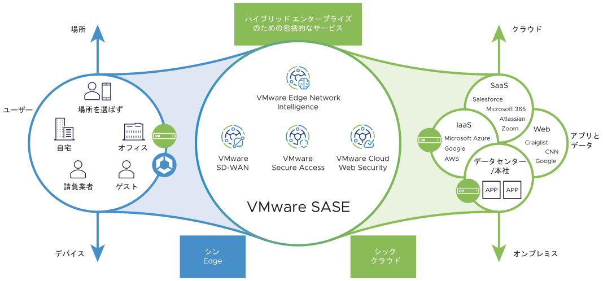](images/GUID-37716F30-5416-4634-8D17-13C5AF99C740-high.png)

<figcaption>

[https://docs.vmware.com/jp/VMware-SASE/index.html](https://docs.vmware.com/jp/VMware-SASE/index.html)

</figcaption>

</figure>

なお、図にはその他にもVMware SD-WAN やEdge Network Intelligence (SD-WAN に組み込まれたネットワーク分析機能、昔Nyansa と呼ばれていました) 、Workspace ONE のアイコンがありますが、SaaS としてマネージドに提供されるSASE のコアコンポーネントとしてはSA とCWS になります。

ポイントとしては、SD-WAN またはWorkspace ONE Tunnel を使ってトラフィックをVMware SASE に通し、それをSASE で分析、必要に応じてブロックするという流れになります。

## VMware SASE のユーザー認証

VMware SASE のCWS はSSO の機能を提供します。SAML に対応しているIdP であればOK （のはず）で、ドキュメントではAzure AD とWorkspace ONE Access での設定方法について記載されています。

[https://docs.vmware.com/en/VMware-Cloud-Web-Security/5.0/VMware-Cloud-Web-Security-Configuration-Guide/GUID-F014AE77-9495-45ED-99EF-1CABFEBDB69F.html](https://docs.vmware.com/en/VMware-Cloud-Web-Security/5.0/VMware-Cloud-Web-Security-Configuration-Guide/GUID-F014AE77-9495-45ED-99EF-1CABFEBDB69F.html)

ちなみに、CWS 側ではそれ以外にもOkta など色々設定できます。

[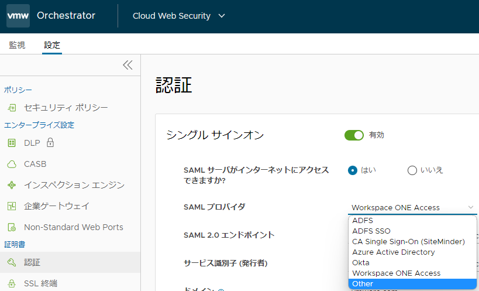](images/image.png)

このSSO の設定をすると、CWS を経由してWeb サービスにアクセスする際にSAML 認証が走り、そこでトラフィックとユーザーの紐づけが行われ、ユーザーをベースにした制御やロギングができるようになります。CWS を使うのであればユーザーとトラフィックの紐づけは行いたいので、ほとんど必須の設定になってくると思います。

さて、ここで疑問なのは、Web サイトへのアクセスの際、例えばyahoo.co.jp へのアクセス時に認証する場合、ユーザーとしてはSD-WAN またはWorkspace ONE トンネルによってCWS にトラフィックが自動的に転送され、その後CWS 側（厳密には連携したIdP）で認証が走り、yahoo.co.jp にアクセスできます。これは、下記ブログで設定方法とともに分かりやすく記載されています。

[https://blogs.vmware.com/vmware-japan/2022/02/vmware-sase-saml.html](https://blogs.vmware.com/vmware-japan/2022/02/vmware-sase-saml.html)

では、他のSAML 対応可能な認証サービス、例えばSalesforce の場合はどうなるのでしょうか。通常既にIdP を利用しSSO の設定をしているのであれば、本来はSalesforce にアクセスしようとした場合、そのタイミングでSAML 認証が走り、SSO できるはずです。つまり、SAML 認証はSalesforce （SP）とIdP で行われるはずなのですが、CWS が間に入ったことで、二重にSAML 認証が走ることになり、ちょっと混乱します。理想的には、CWS 側で認証すれば、Salesforce へのアクセスはパスワードレスにアクセスできれば（もしくは必要に応じて多要素認証）いいのですが、CWS でパスワードを入力し、Salesforce でもパスワードを入力するなど、同じ認証方式を2 回実行しなければならないとしたら、これは中々ストレスです。

ということで、今回はこのあたりの認証フローをはっきりさせるために色々検証してみました。

## Workspace ONE UEM とSecure Access の接続

今回はSD-WAN は使わず、Workspace ONE UEM とTunnel を使ってSASE へ接続します。設定方法に関しては下記ドキュメント通りですが、念のため簡単に手順を記載します。なお、この時点ではWorkspace ONE Access は登場しないことに注意してください。

[https://docs.vmware.com/en/VMware-Secure-Access/5.0/VMware-Secure-Access-Configuration-Guide/GUID-5125D87B-BD8A-411F-981E-1B9D12B061DB.html](https://docs.vmware.com/en/VMware-Secure-Access/5.0/VMware-Secure-Access-Configuration-Guide/GUID-5125D87B-BD8A-411F-981E-1B9D12B061DB.html)

まずはWorkspace ONE UEM 側の設定を行います。Workspace ONE UEM のPer App VPN を設定したことがあれば理解しやすいと思いますが、SASE SA との接続はオンプレUAG を使ったPer App VPN と同じです。つまり、UAG がSA としてクラウドにデプロイされ、そことPer App VPN を張るイメージになります。

手順通り組織グループを作成します。これは必須ではないですが、基本的にUEM のどの検証においても組織グループを作成してから設定変更することを推奨します。そうしないと、親組織グループで作成した設定が残って意図していない事象が発生する可能性があるためです。

[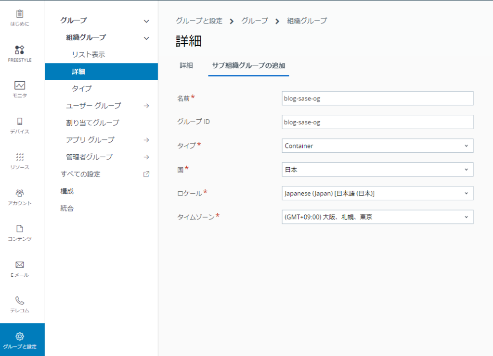](images/image-3-1024x741.png)

グループID は入力してください。（可能であれば）組織グループ名と同じが分かりやすいと思います。国やロケール、タイムゾーンは任意です。タイプはデフォルトで構いません（ここではContainer）。

組織グループを作成すると自動的に作成した組織に入ります。作成した組織で操作できているかは画面上部の組織グループ名を見ればわかります。ここでカーソルを置くとグループID が表示されますので、これをどこかにメモしておきます。

[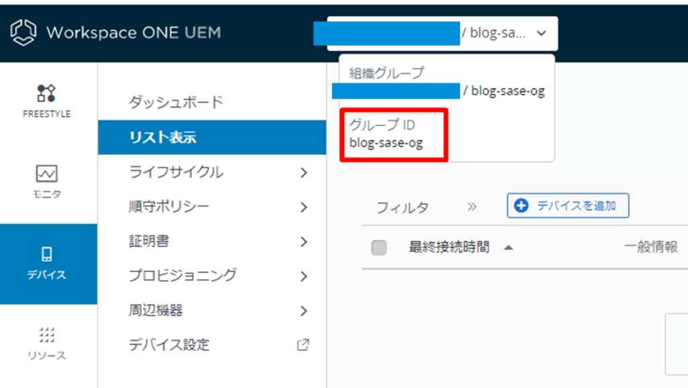](images/image-4-1024x578.png)

次に、その組織グループに管理者ユーザーを作成します。これは組織グループの操作とSA との接続に使います。手順は下記ドキュメントの通りですのでここでは省略します。

[https://docs.vmware.com/en/VMware-Workspace-ONE-UEM/services/UEM\_ConsoleBasics/GUID-AdminAccounts.html](https://docs.vmware.com/en/VMware-Workspace-ONE-UEM/services/UEM_ConsoleBasics/GUID-AdminAccounts.html)

次の手順の基本ユーザーの作成も同様に実施します。このユーザーはデバイスと紐づけるユーザーとなります。同様にドキュメントの通り実施します。

[https://docs.vmware.com/en/VMware-Workspace-ONE-UEM/services/UEM\_ConsoleBasics/GUID-BasicUserAccounts.html](https://docs.vmware.com/en/VMware-Workspace-ONE-UEM/services/UEM_ConsoleBasics/GUID-BasicUserAccounts.html)

なお、Workspace ONE UEM の管理者ユーザーのパスワードは30日で切れるという厄介な仕様があります。試していませんが、このパスワードの変更に対応しSA 連携設定の変更を定期的にしなければならない可能性がありますので（オンプレUAG のPer App VPN の時はこの問題がありました）、本番ではAD ユーザーを使用してください。

[https://kb.vmware.com/s/article/2960356](https://kb.vmware.com/s/article/2960356)

次の手順はトンネルの設定ですが、その前にデバイスを加入させます。今回は仮想マシンのWindows 10 を用います。加入方法は色々ありますが、[https://getwsone.com/](https://getwsone.com/) から取得できるインストーラ経由で加入させるのが最も簡単です。下記動画の通り進めてください。ここで先ほどメモしたグループID が必要になります。

https://www.youtube.com/watch?v=FGMOxcLa7EQ

問題なく加入できたら、トンネルの設定を実施します。ポートは443 にしてください。また、ここで入力するホスト名ですが、現時点ではホスト名後半が sa.gsm.vmware.com で固定となっていますので、前半部分を任意に入力します。たとえばblog-sase-og.sa.gsm.vmware.com など、比較的重複しにくいものを選択してください。この時点ではまだblog-sase-og.sa.gsm.vmware.com のエンドポイントは存在しませんが、後でSA 側の設定をする際にこのドメインを払い出します。

[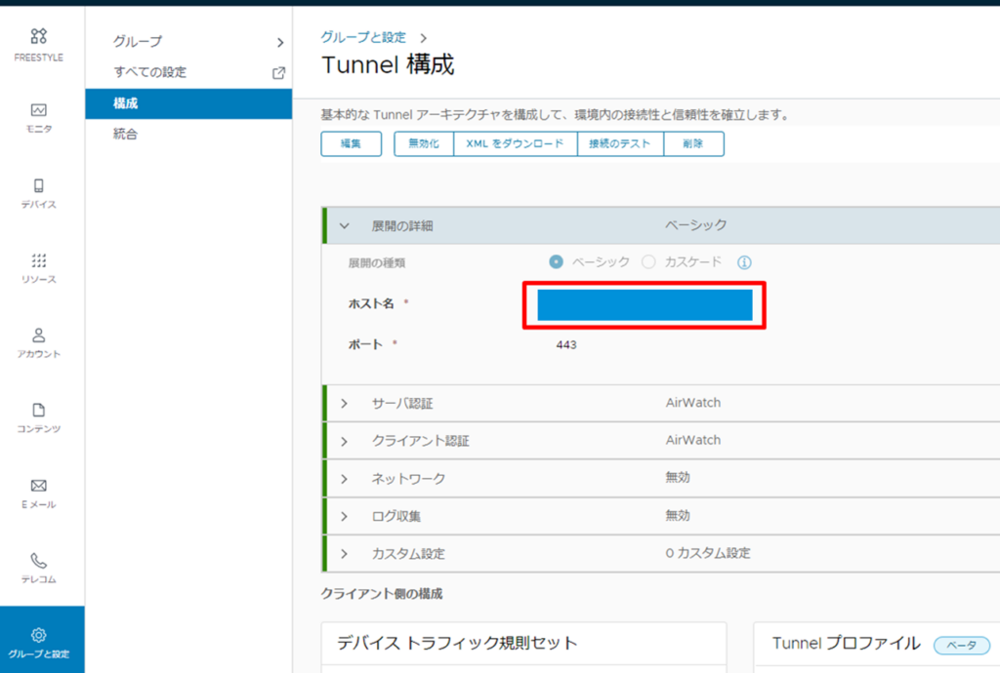](images/image-5-1024x690.png)

また、デバイストラフィックルールを設定します。この設定はVPN を使う/使わないの設定をトンネルで設定するためのものです。フルデバイスVPNの方が設定が簡単なので、ここではスクリーンショットのようにフルデバイスVPN を選択し、\*.vmware.com への通信はトンネルを使い、\*.facebook.com はブロック、その他はトンネルを使わない設定にしました。

[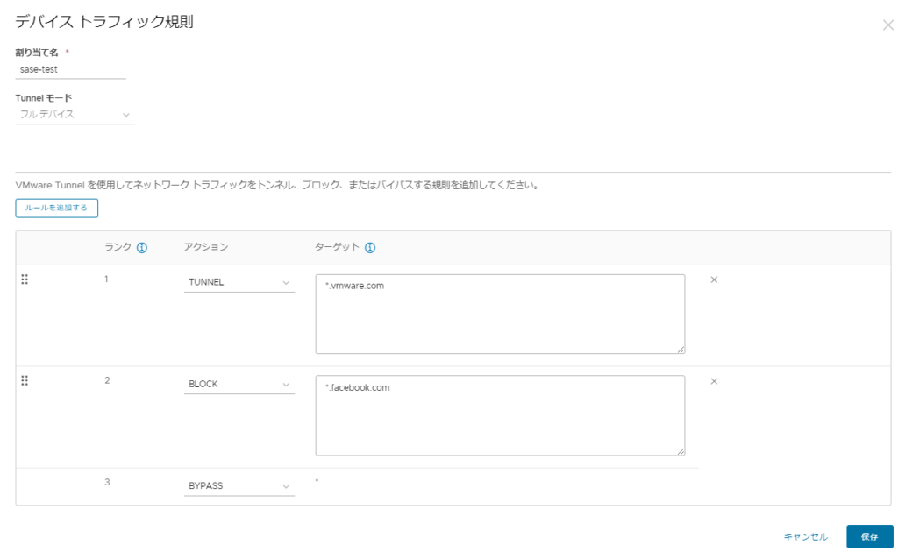](images/image-13-1024x630.png)

さて、次にトンネルアプリをWorkspace ONE UEM 経由でデバイスに配ります。下記の通り実施すれば配布は問題ないはずです。

[https://techzone.vmware.com/deploying-vmware-workspace-one-tunnel-workspace-one-operational-tutorial#distributing-workspace-one-tunnel-for-windows-10](https://techzone.vmware.com/deploying-vmware-workspace-one-tunnel-workspace-one-operational-tutorial#distributing-workspace-one-tunnel-for-windows-10)

注意点として、2023/2/4 時点でのWindows 版トンネルの最新バージョンは3.1 ですが、これはスタンドアロン版専用なので、2.1.7 を選択してください。

[https://kb.vmware.com/s/article/88311](https://kb.vmware.com/s/article/88311)

<figure>

[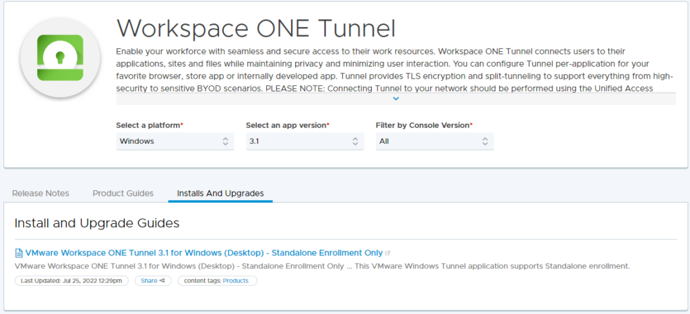](images/image-8-1024x467.png)

<figcaption>

Standalone Enrollment Only のバイナリの場合はWorkspace ONE UEM で管理下のデバイスに対応していません。

</figcaption>

</figure>

また、参考までに、ドキュメントの手順の場合バージョンが若干古いので、念のため私の環境のトンネルのバージョン2.1.8 における設定値の一部を共有しておきます。

[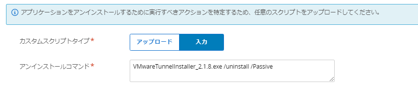](images/image-9.png)

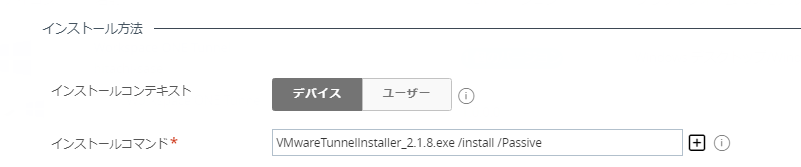

トンネルのインストールが無事完了したら、次にプロファイルの設定を行います。これにより、先にUEM 側で設定したSA との接続設定をデバイスに流します。

[https://techzone.vmware.com/deploying-vmware-workspace-one-tunnel-workspace-one-operational-tutorial#creating-per-app-vpn-profile-for-windows-10](https://techzone.vmware.com/deploying-vmware-workspace-one-tunnel-workspace-one-operational-tutorial#creating-per-app-vpn-profile-for-windows-10)

[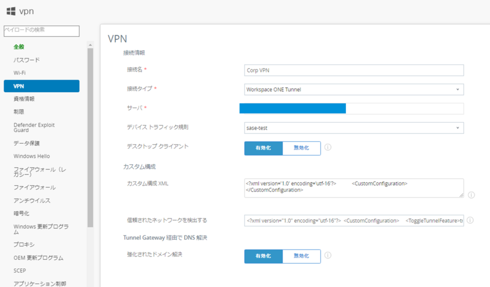](images/image-11-1024x601.png)

一応これでUEM 側の設定は完了です。同期が完了し、デバイス側で問題なくトンネルの設定ができていることを確認します。

[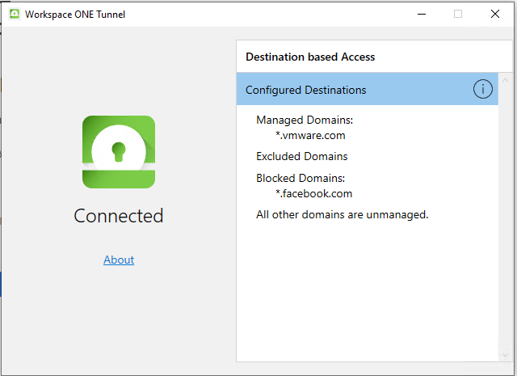](images/image-15.png)

ここまで完了したら、今後はSA 側の設定を行います。下記ドキュメントの通り実施すれば詰まることはないはずですが、いくつか注意点を共有します。

[https://docs.vmware.com/en/VMware-Secure-Access/5.0/VMware-Secure-Access-Configuration-Guide/GUID-EA0D9561-47B8-435B-B633-A6AAC57ABE53.html](https://docs.vmware.com/en/VMware-Secure-Access/5.0/VMware-Secure-Access-Configuration-Guide/GUID-EA0D9561-47B8-435B-B633-A6AAC57ABE53.html)

まず、ドキュメントの画像のDNS 名ですが、これは2023/2/4 現在sa.velocloud-test.net ではなく sa.gsm.vmware.com です。

次に、わかりづらいエンタープライズ IP 範囲 のカスタマーサブネット設定ですが、これは任意で構いません（例えば192.168.0.0/24）。デバイスのIP アドレスレンジを指定するわけではないです。トラフィックがSA 到達後にプロキシによってSNAT されるため、そのIP アドレスを指定します。実際にCWS のログを見ると、送信元IP アドレスはここで定義したIP アドレス範囲から任意に指定されます。

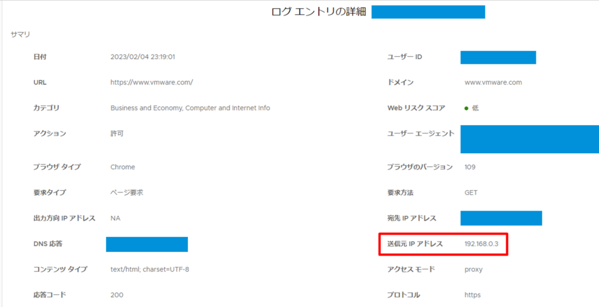

サブネットビットは先に指定したカスタマーサブネットの中でサブネットを分けるために指定します。特に問題なければ1 でいいと思います。

なお、後で有効化するため、現時点では「CWS と Secure Access の関連付け」のチェックはしなくて大丈夫です。

[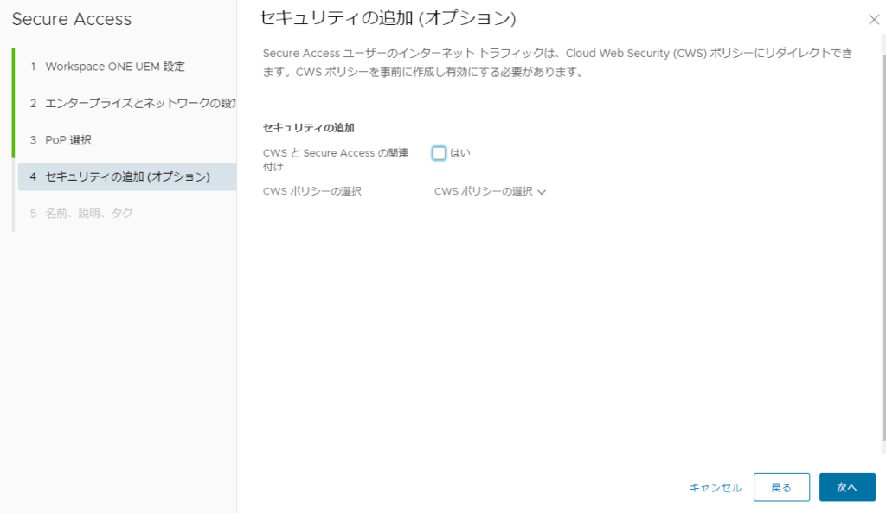](images/image-14-1024x593.png)

以上の設定が完了したら、UEM のトンネルの設定メニューから接続のテストができますので、接続テストが成功することを確認します。

[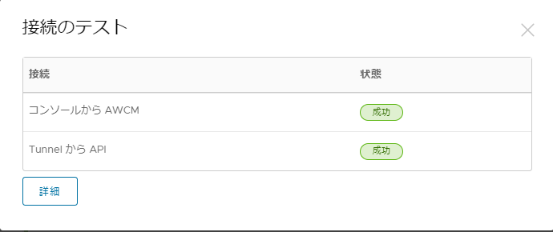](images/image-6.png)

これでWorkspace ONE UEM とSA の設定が完了しました。一応、デバイスからvmware.com にはアクセス可能で、facebook.com にはアクセス不可であることを確認します。ただし、この時点ではvmware.com へのアクセスがSA を経由したものなのかが分かりづらいので、この後にCWS の設定を行うことでこれを確認していきます。

## Cloud Web Security の設定

まず、CWS のセキュリティポリシーを作成します。このセキュリティポリシーの中に、URL フィルタリングやサンドボックス解析などの条件等が定義されます。CWS もSA と同様SDWAN オーケストレーターのUI から設定を行います。UI 上方のタブからCloud Web Security を選択し、設定→セキュリティポリシー→新規ポリシーからポリシーの名前を任意に指定します。

[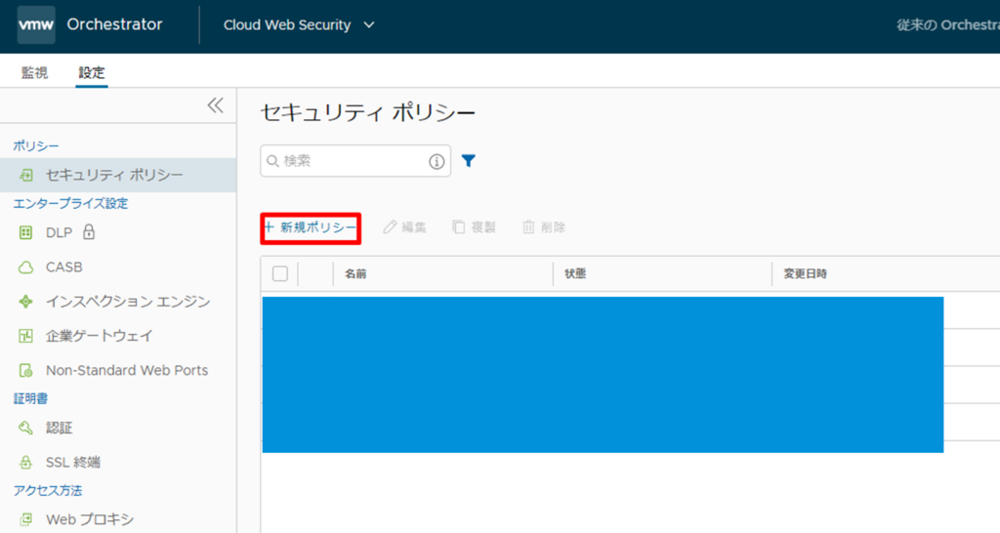](images/image-16-1024x546.png)

作成したポリシーを選択すると、色々なセキュリティ機能をここで定義できますが、今回はデフォルトのまま進めます。デフォルトでは、すべてのトラフィックに対するSSL 検査が実行されますが、このポリシーを公開します。公開しないとSA と紐づけることができないので注意してください。

[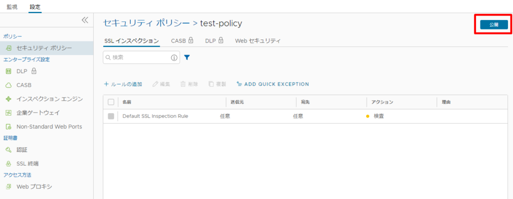](images/image-17-1024x398.png)

なお、本来はWorkspace ONE やMicrosoft のサイトなど、SSL Inspection をバイパスする設定をここで入れるべきです。幸いにもADD QUICK EXCEPTION から簡単に追加することができますが、今回はそもそもトンネル側の設定でvmware.com のみSA を通すように設定しているので、ここは特に問題になりません。

SA の設定に戻り、Secure Access ポリシーを編集し、CWS と Secure Access の関連付けにチェックを入れ、先ほど作製したセキュリティポリシーを割り当てます。

[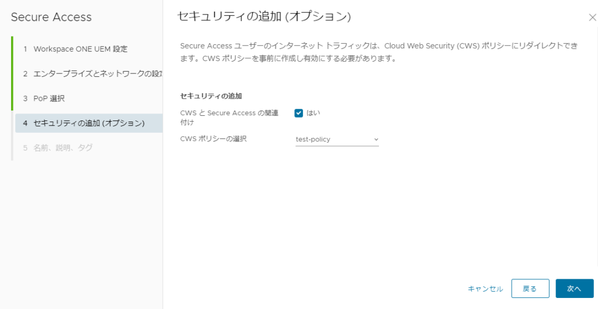](images/image-18-1024x531.png)

この状態でvmware.com にアクセスすると証明書エラーが出ます。これは意図された挙動で、サーバー証明書を見るとVeloCloud Root CA 認証局証明書がありますが、この証明書をブラウザが信頼していないため、SSL エラーが発生しています。

[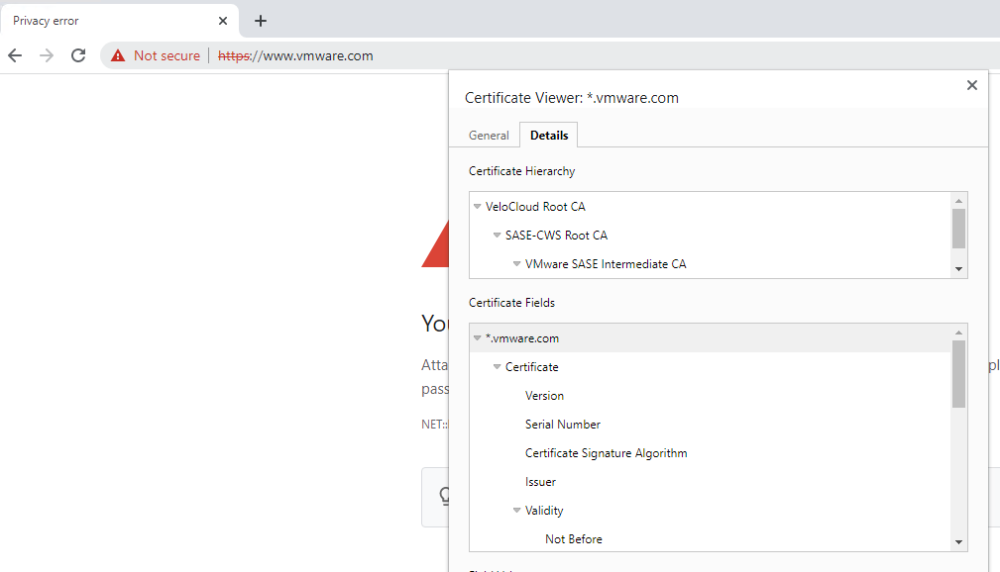](images/image-19.png)

VMware SASE のCWS （というより一般のSSL 復号化）はSSL による暗号化を解除するために、証明書のやり取りが発生するSSL セッションを仲介します。つまり、vmware.com にアクセスする場合、本来証明書のやり取りはクライアントとvmware.com で行いますが、これをクライアント ⇔ CWS ⇔ vmware.com といった感じに2 つのセッションが発生し、クライアントはCWS と証明書のやり取りをします。これにより、（自身の）秘密鍵を知っているCWS はクライアントからのトラフィックを復号化できるわけです。ただ、あくまでもクライアントはvmware.com にアクセスしたいので、CWS としてはvmware.com のふりをする必要があります。そのために証明書を勝手に作り、「自分はvmware.com だよー」とウソを付きます。とはいえ、ウソはChrome さんに証明書チェーンを通して簡単に見破られますので、Chrome さんにこの証明書は信頼できるからOK だよ、というのを教えてあげる必要があり、そのためにクライアント側へのルート証明書のインストールが必要になります。

[https://milestone-of-se.nesuke.com/nw-basic/tls/decrypt-intercept/](https://milestone-of-se.nesuke.com/nw-basic/tls/decrypt-intercept/)

WS1 UEM のプロファイル機能を使えば、この証明書を簡単に配布することができます。

ルート証明書をCWS の設定→ SSL 終端からダウンロードします。

[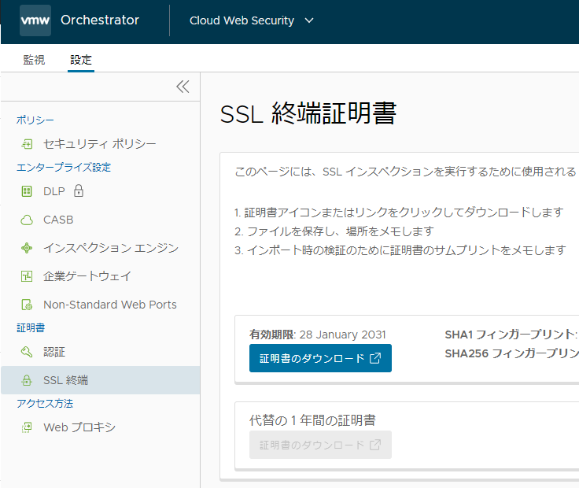](images/image-22.png)

UEM 側でトンネルの設定を入れたプロファイルを編集し、資格情報からダウンロードした証明書をアップロードします。証明書ストアを「信頼されたルート」に設定することを忘れないでください。

<figure>

[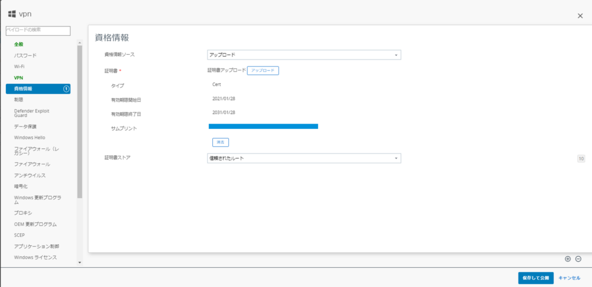](images/image-21-1024x497.png)

<figcaption>

しばらく経つとプロファイルがインストールされ、Chrome にVeloCloud Root CA がインストールされます。

</figcaption>

</figure>

[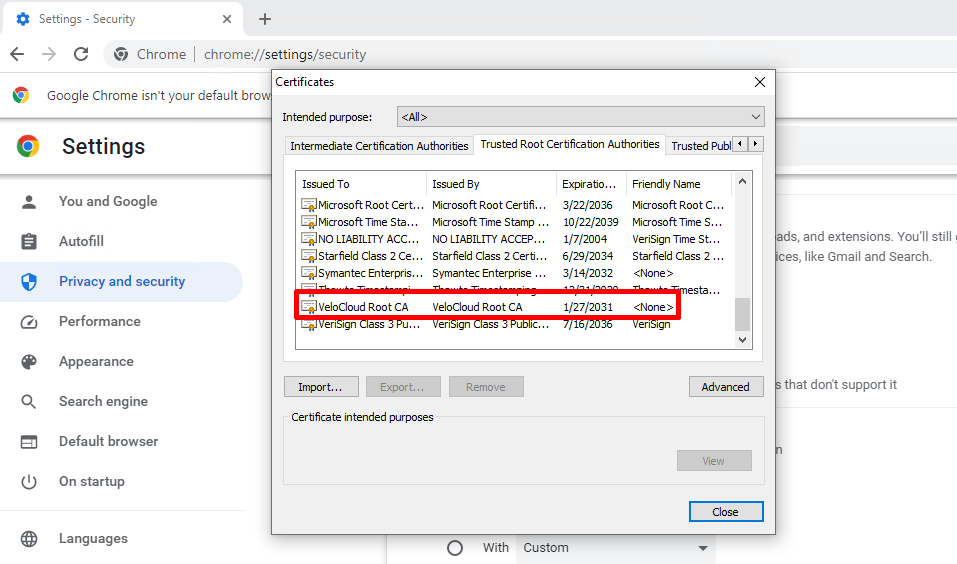](images/image-20.png)

もちろんChrome の設定から直接証明書をインストールしても構いません。なお、テスト的にインストールしたRoot CA をChrome から削除する場合はChrome を管理者として実行してから削除することに注意してください。

この状態でvmware.com にアクセスすると、一瞬CWS のURL にリダイレクトされ、その後vmware.com にSSL エラーなしにアクセスすることができるはずです。

<figure>

[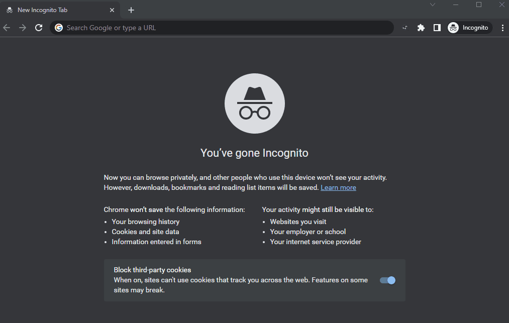](images/Animation.gif)

<figcaption>

一瞬safe-cws-sase.vmware.com にリダイレクトされていることがわかります。

</figcaption>

</figure>

これにてWorkspace ONE UEM、Secure Access、Cloud Web Security の一通りの設定は完了しました。お疲れ様でした。

## CWS のSSO 設定

残念ながら？本題はここからです。SAML 対応のサイトにアクセスしたときに、認証のフローがどうなっているのか確かめます。

### その前におさらい SP Initiated とIdP Initiated

SP Initiated とはSP、つまりアクセスしたいサービス側に先にアクセスしてSAML 認証が走ります。例えばSalesforce にアクセスしたい場合、\*\*\*.salesforce.com にユーザーがアクセスしたタイミングで自動的にIdP にリダイレクトされ、その後SP に再度リダイレクトされる認証フローになります。

IdP Initiated とはIdP、つまりIdP が提供するカタログサービスなどに先にアクセスして認証し、その後SP へとアクセスします。

フローとしては下記が分かりやすいです。

[https://manual.iij.jp/iid/faq/19644038.html](https://manual.iij.jp/iid/faq/19644038.html)

認証のイメージが掴めていない方は、下記動画が参考になるかと思います。

https://www.youtube.com/watch?v=UW9Q0Dhpfog

今回はIdP としてWorkspace ONE Access を使い、SP Initiated / IdP Initiated 両方でどのような挙動になるか確かめます。

### その前におさらい Workspace ONE Access

Workspace ONE Access の基本でありながら重要なこととして、ID プロバイダとアクセスポリシーという概念を理解しなければなりません。これらは非常にわかりづらいのですが、理解しないと設定の意味がまるで分からなくなりますので、先に解説します。

**ID プロバイダとは「認証できるユーザーと認証方式の組み合わせ」**です。つまりWorkspace ONE Access の認証の中核です。Okta などを使わず、Workspace ONE Access で認証する（＝Workspace ONE Access をIdP として使う）場合は組み込みID プロバイダとして設定します。

**アクセスポリシーとは「どのデバイスやユーザーが、どのようなアプリに対して、どのような認証方式でアクセスするかという制御」**です。初期状態ではデフォルトアクセスポリシーが定義されています。

デフォルトアクセスポリシーというのは、その名の通りデフォルトのアクセスポリシーなのですが、Workspace ONE Access カタログに対するアクセスポリシーでもあります。ここを迂闊にいじると、管理者でさえWorkspace ONE Access のカタログにアクセスできず、 カタログからアクセスする設定画面にもアクセスできなくなる可能性があります。そのため、**数多くの管理者がデフォルトアクセスポリシーを弄り、Workspace ONE Access を出禁になるという悲しい事件が発生**するのですが、幸いにも回避策はあり、https://<exampleFQDN.com>/SAAS/admin というURL でアクセスするとカタログ経由無しで設定コンソールに直接アクセスすることができます。

[https://docs.vmware.com/en/VMware-Workspace-ONE-Access/services/ws1\_access\_service\_administration\_cloud/GUID-82FE0AD9-7124-4614-A1CA-9239EB7094B4.html](https://docs.vmware.com/en/VMware-Workspace-ONE-Access/services/ws1_access_service_administration_cloud/GUID-82FE0AD9-7124-4614-A1CA-9239EB7094B4.html)

話が少しそれましたが、**アクセスポリシーの中にはIdP の設定項目はありません。**つまり、IDプロバイダーは単に「認証できるユーザーと認証方式の組み合わせ」として先に定義され、ここで指定した認証方式がアクセスポリシーで設定できるようになり、アクセスポリシーで選んだ認証方式に対して対応しているIdP （ドメイン）が自動的に選ばれます。

分かりづらいので例を出します。デフォルトアクセスポリシーで認証方式にパスワード（ローカルディレクトリ）を指定するとします。これは要するにWorkspace ONE Access で作成したユーザー/パスワードで認証するということです。

[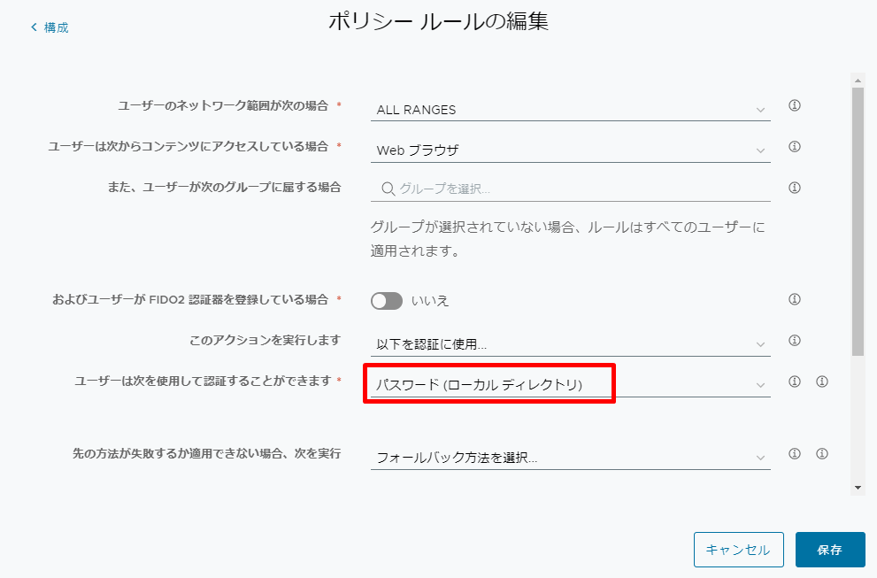](images/image-23.png)

ID プロバイダとしては、ここではSystem Identity Provider とBuilt-in の2 つがあります。それぞれユーザーディレクトリとしてはシステムディレクトリ（管理者が所属）とtest.lab （このドメインユーザーが所属）が紐づいており、さらに、認証方式として前者にパスワード (ローカル ディレクトリ) とFIDO2、後者には認証子アプリケーション、パスワード (ローカル ディレクトリ)、証明書 (クラウド デプロイ) が紐づいています。

[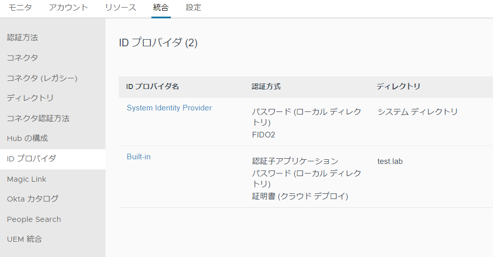](images/image-24.png)

ここで、カタログにアクセスすると何が起こるでしょうか。

[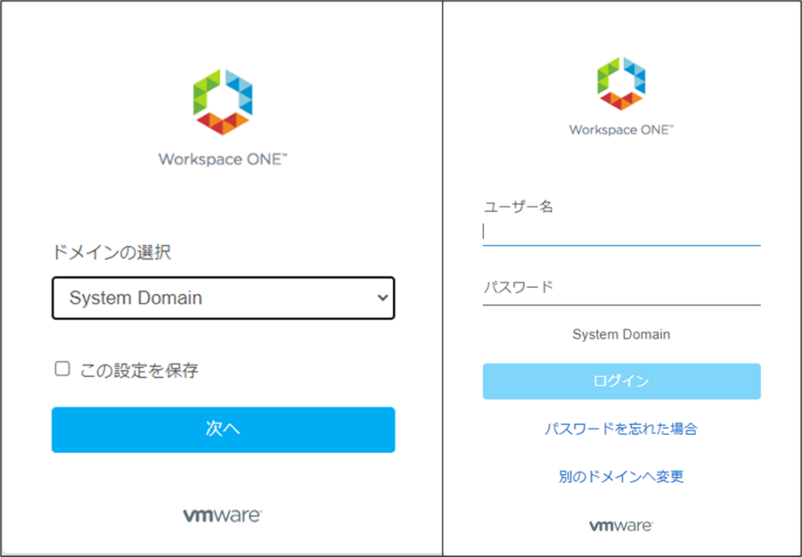](images/image-31-1024x712.png)

[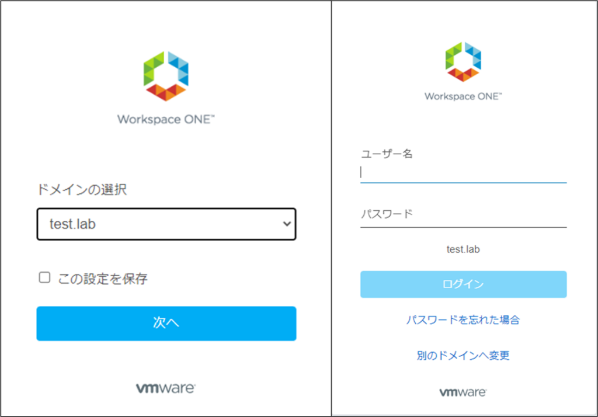](images/image-30-1024x714.png)

ドメインとして2 つ選ぶことができました。また、いずれもユーザー名/パスワードを認証に求められました。

つまり、パスワード (ローカル ディレクトリ) を認証方式として使えるID プロバイダが2つあるため、対応するIDプロバイダ（と紐づくドメイン）を選択し、認証するという形になります。

では今度はBuilt-in ID プロバイダからパスワード (ローカル ディレクトリ) の認証方式を削除します。

[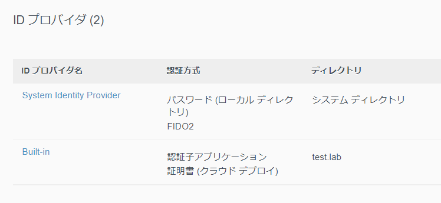](images/image-27.png)

今度はどうなるでしょうか。

[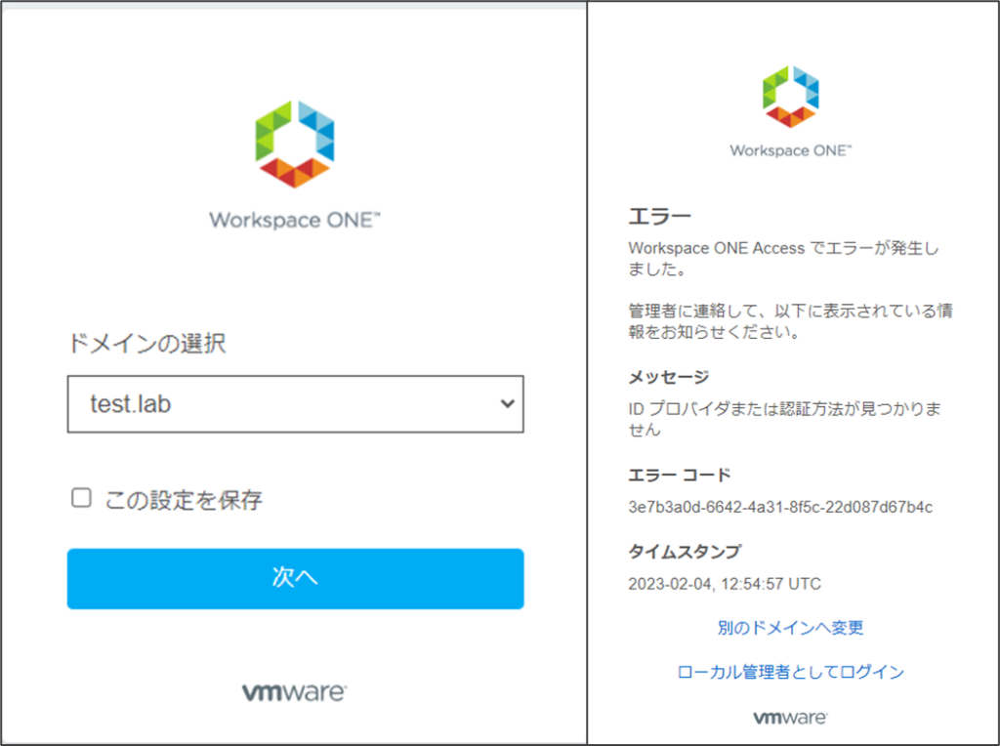](images/image-32-1024x764.png)

ドメインは選択できますが、その後Built-in ID プロバイダ（test.lab）を選択するとエラーが発生します。デフォルトポリシーで指定した認証方式であるパスワード (ローカル ディレクトリ) が使えないためです。

以上をまとめると、アクセスポリシー、ID プロバイダ、ユーザーディレクトリ、ドメイン、ユーザーは図のような関係になります（他にも定義できる項目はありますが大まかにまとめるとこんな感じです）。**アクセスポリシーで定義する認証方式によってID プロバイダが紐づけられる点がポイントです。**

[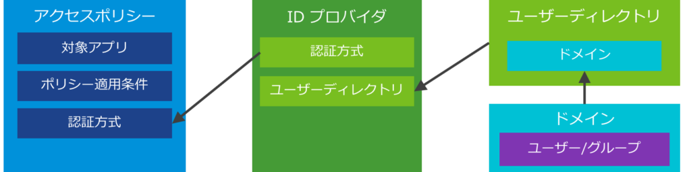](images/image-33-1024x257.png)

### Workspace ONE Access の設定

設定は下記ドキュメントとブログを参考に進めます。

[https://docs.vmware.com/en/VMware-Cloud-Web-Security/5.0/VMware-Cloud-Web-Security-Configuration-Guide/GUID-2FE12390-B33E-43C2-BC8D-95E8072D3CFF.html](https://docs.vmware.com/en/VMware-Cloud-Web-Security/5.0/VMware-Cloud-Web-Security-Configuration-Guide/GUID-2FE12390-B33E-43C2-BC8D-95E8072D3CFF.html)

[https://blogs.vmware.com/vmware-japan/2022/02/vmware-sase-saml.html](https://blogs.vmware.com/vmware-japan/2022/02/vmware-sase-saml.html)

まずはドキュメントに従い、CWS のSAML 連携のためにアプリケーションを作成します。ここは特に詰まるところはないので手順は省略します。アクセスポリシーはデフォルトポリシーを選択します。なお、私の場合デフォルトポリシーには管理者ユーザー（システムディレクトリ）とパスワード (ローカル ディレクトリ) の認証方式が紐づけています。また、ドキュメントと同様、すべてのユーザーに作成したCWS アプリケーションを割り当てました。これで、**CWS へアクセスするユーザーすべてがデフォルトアクセスポリシーを使って認証されることになります。**

### CWS の設定

これも先のドキュメントの通りなので割愛します。ただ、ドキュメントにはないドメイン設定に関しては私も確認中です。説明を見ると「ドメイン設定はCWSが各IdPに認証要求を送信するためのEnterprise Userを識別するために使用されます」といったように書いていますが、そもそもIdP は1 つしか設定できないので識別したとしても同じIdP を使いますし、実際にテキトーなドメインを設定してもIdP にリダイレクトされました。とはいえ認証するユーザーのドメインにしておくのが無難です。

[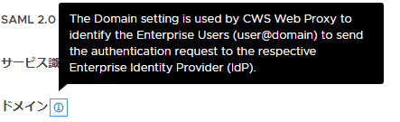](images/image-34.png)

CWS の設定が完了すると、vmware.com にアクセスしようとするとWorkspace ONE Access にリダイレクトされ、そこで認証をするとvmware.com にアクセスできます。

[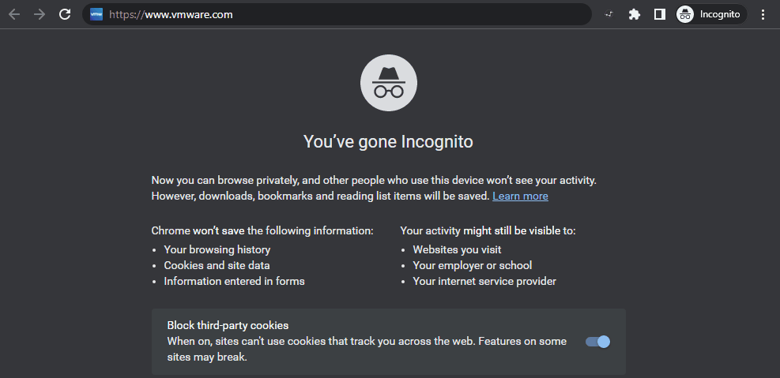](images/Animation-1.gif)

### SAML アプリケーションの設定

先ほどは通常のWeb へのアクセスを試しましたが、いよいよSAML 対応のWeb アプリケーションへのアクセスを試します。ここでは、SAML のテストではおなじみの[https://sptest.iamshowcase.com/](https://sptest.iamshowcase.com/) を使います。

まず、トンネルの設定で\*.iamshowcase.com へのトラフィックがSA を経由するようにルールを変更し、プロファイルを再配布します。

[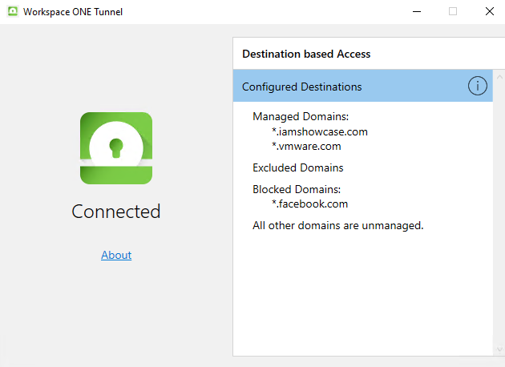](images/image-35.png)

先にIdP Imitated の設定をします。

SAML アプリケーションに割り当てるアクセスポリシーを作成します。デフォルトアクセスポリシーだとどういう認証フローになるかが分かりづらいので、個別に作成し割り当てます。認証方式はせっかくなので最近サポートされたおすすめの多要素認証方式であるTOTP 認証を使います。設定方法は下記が分かりやすいです。私は認証子アプリケーションとしてGoogle Authenticator を使います。

[https://blog.jpeuc.net/archives/440](https://blog.jpeuc.net/archives/440)

私の場合管理者ユーザーでアクセスするので、System Identity Provider に対して認証子アプリケーションを紐づけました。

[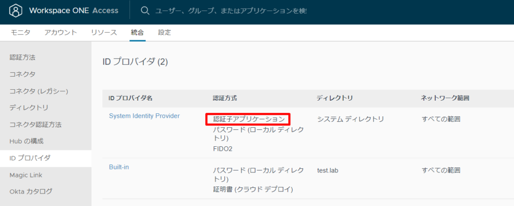](images/image-39-1024x411.png)

アクセスポリシーの作成画面では下図のように設定します。認証子アプリケーションは2 爪の認証方式（AND 条件）としてしか定義できないことに注意してください。ユーザー名/パスワードを入力した後、Google Authenticator の番号を入力するイメージです。なお、再認証までの待機時間は短めにした方がテストとしては楽です。

[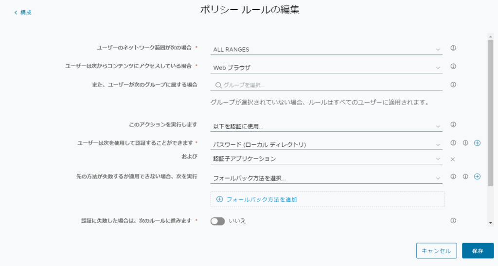](images/image-40-1024x547.png)

その後、Workspace ONE Access のリソース→Web アプリケーションから新しいWebアプリケーションを作成します。その際、メタデータ入力欄に https://sptest.iamshowcase.com/testsp\_metadata.xml と入力します。アクセスポリシーは先に作成したものを選んでください。

[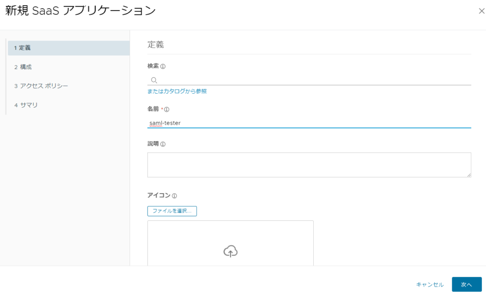](images/image-37-1024x627.png)

[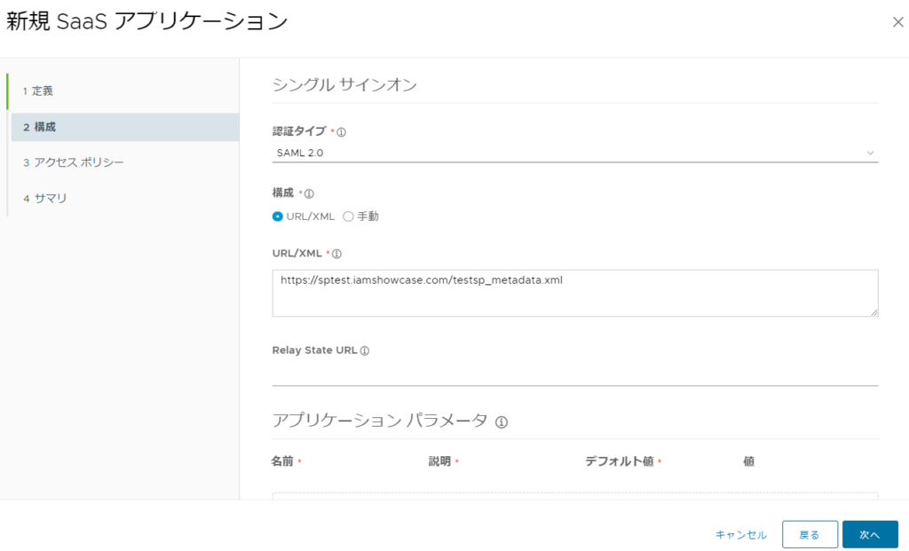](images/image-38-1024x621.png)

作成したアプリケーションをユーザーに割り当てます。展開の種類は自動にしてください。

[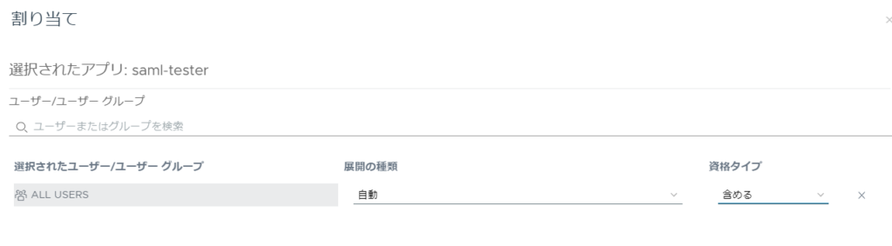](images/image-42-1024x283.png)

IdP Initiated の設定は完了したので、次にSP Initiated の設定をします。リソース→Web アプリケーション→設定からWorkspace ONE Access のIdP メタデータをxml ファイルでダウンロードします。

[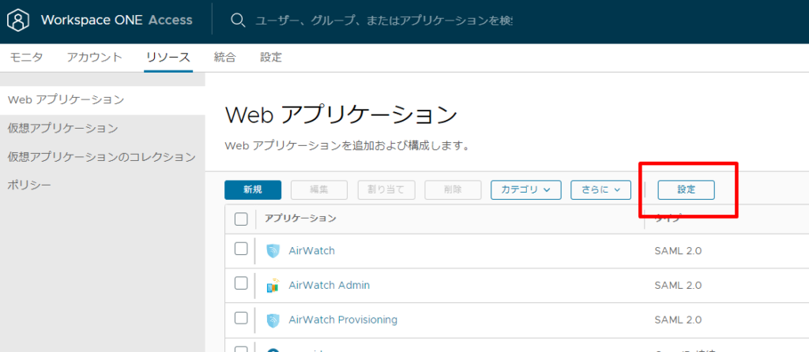](images/image-43-1024x446.png)

[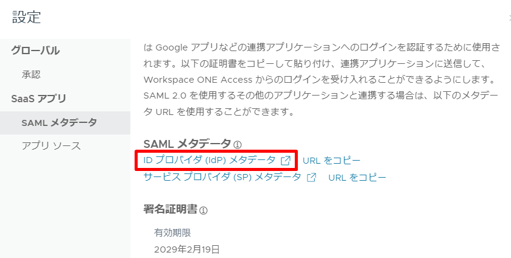](images/image-44.png)

下記URL にアクセスし、ダウンロードしたxml ファイルをアップロードすると、SP Initiated 用のURL が発行されます。

[https://sptest.iamshowcase.com/instructions#spinit](https://sptest.iamshowcase.com/instructions#spinit)

[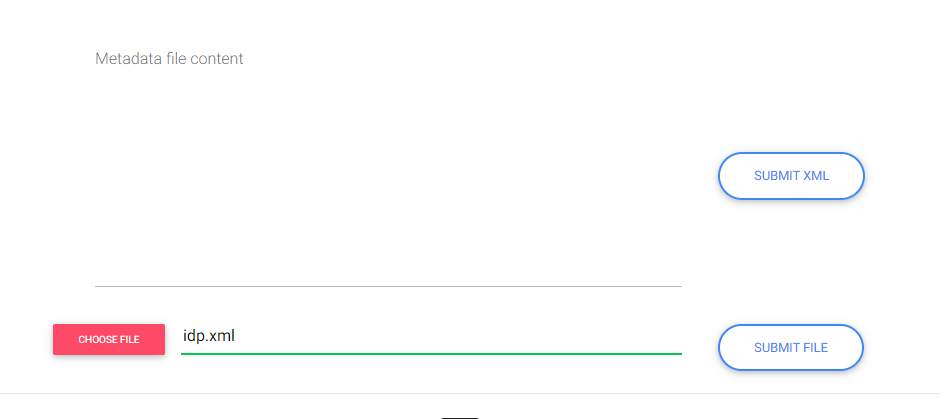](images/image-45.png)

[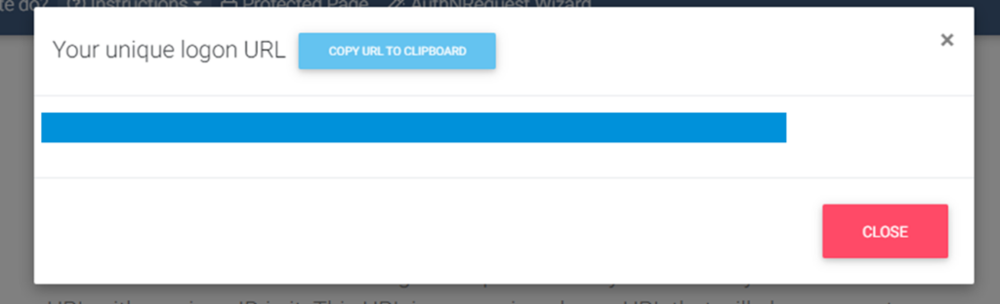](images/image-46-1024x312.png)

これで準備完了です。

## 実際にアクセスしてみた

### IdP Initiated の場合（カタログ経由でアプリケーションにアクセス）

[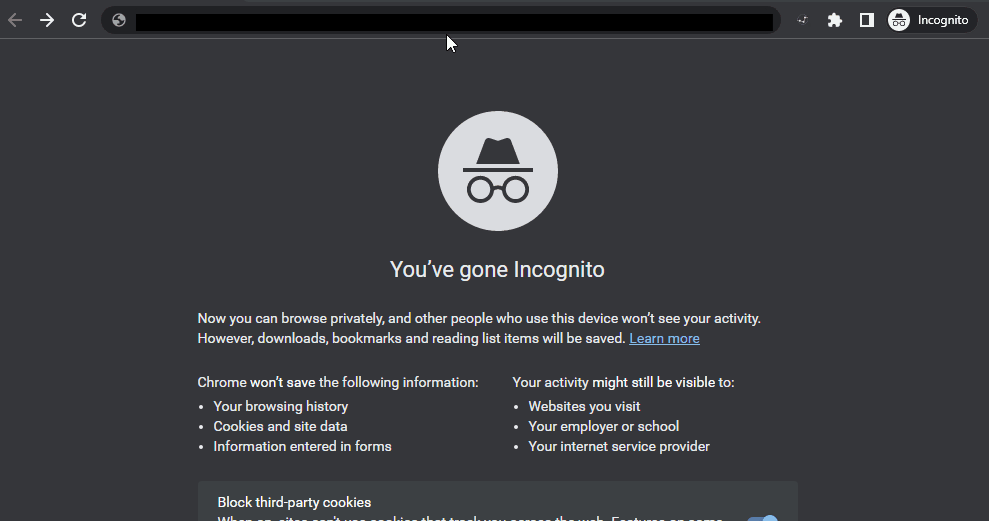](images/Animation3.gif)

safe-cws-sase.vmware.com にリダイレクトされるタイミングに注目してください。すなわち、認証フローとしては下記の通りです。

1. カタログの認証（デフォルトアクセスポリシーでの認証）
    - ユーザー名/パスワード入力
2. アプリケーションの認証（アプリケーションのアクセスポリシーでの認証）
    - Google Authenticator コードの入力
    - アクセスポリシーで設定していたユーザー名/パスワード入力は既に入力したのでスキップ
3. CWS へのリダイレクトとCWS 側での認証（CWS のデフォルトアクセスポリシーでの認証）
    - ユーザー名/パスワード入力は既に入力したのでスキップ

### SP Initiated の場合（アプリケーションに直接アクセス）

[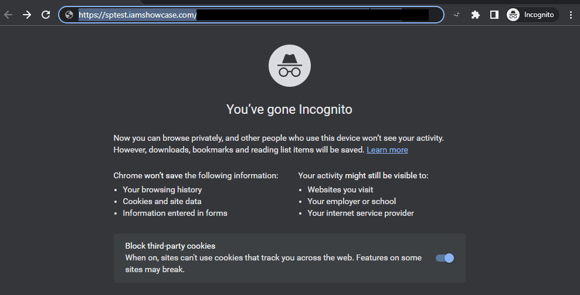](images/Animation2.gif)

safe-cws-sase.vmware.com にリダイレクトされるタイミングに注目してください。すなわち、認証フローとしては下記の通りです。

1. CWS の認証（CWS のデフォルトアクセスポリシーでの認証）
    - ユーザー名/パスワード入力
2. アプリケーションへのリダイレクトとアプリケーション側での認証
    
    1. Google Authenticator コードの入力
    
    - ユーザー名/パスワード入力は既に入力したのでスキップ

なお、いずれも初回の認証の場合認証子アプリケーションの登録が必要です。

## 結論

CWS とアプリケーション側での2回の認証が走ります（IdP Initiated の場合は最初のカタログアクセスでも認証されます）。ただし、例えば共通でデフォルトアクセスポリシーを使うなど、CWS とアプリケーションで認証方式が同一であれば2回目の認証はスキップされ、SSO が実現できます。

カタログ経由でのアクセスの場合は、カタログに定義したアプリケーションへアクセスすると、IdP Initiated なのでアプリにアクセスする前にまずは認証が走ります（先の例だとGoogle Authenticator で認証します）。その後SP にリダイレクトされるはずが、トンネルがあるためにCWS にバイパスされ、そこでCWS のSAML 認証が走ります。無事認証を終えたらCWS を経由してアプリにアクセスできます。つまり、**アプリのIdP Initiated 認証 → CWS のSP Initiated 認証の順番です**。

直接アプリにアクセスする場合は、トンネルがあるためにCWS にバイパスされ、先にCWS で認証が走ります。無事認証を終えたらCWS を経由してアプリにアクセスし、アプリ側で認証が走ります。つまり、**CWS のSP Initiated 認証 → アプリのSP Initiated 認証の順番です。**

ということで、結論としては「なんだかんだうまく処理している」でした。今回はWorkspace ONE Access ですが、Azure AD でも同様の結論になるはずです。
