[過去に書いたvSphere Lifecycle Manager (vLCM)の記事](https://blog.vpantry.net/posts/vlcm-2)が人気なのですが、残念ながら記事が古くあまり参考になりません。また、vSphere8.0 よりvLCM の設定がデフォルトで有効になっているため注意が必要ということで、せっかくなので新しく記事を書くことにしました。

## vSphere Lifecycle Manager (vLCM) とは？

基本的な概念は以前の記事と変わりません。クラスタ内のホストの状態をなるべく共通化するように、宣言的にプロファイル、つまりイメージや設定を割り当てる機能です。宣言的、というのが特徴で、定義したプロファイルとズレがある場合、例えばクラスタで望ましいイメージはESXi7.0U3f、と宣言されている中、あるホストだけESXi7.0U3e の場合には、宣言された状態と異なるということで警告が出ます。その警告に対して、管理者は修正（Remediation）をすることで、ESXi7.0Uf にパッチをあて、結果的にクラスタ中のホストのイメージが共通化されます。

[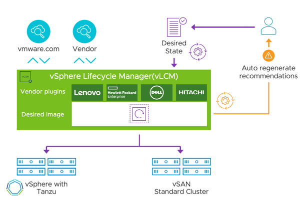](images/image.png)

## イメージとは？

ベースイメージ（Base Image）、アドオン（Addon）、コンポーネント（Component）で構成される宣言的プロファイルの単位です。これらに関する説明は以前の記事を参照していただければと思いますが、ポイントは**「ベースイメージ+アドオン=カスタムイメージ」**という点です。カスタムイメージとは、Dell などのOEM ベンダーが提供する独自のESXi バイナリで、VMware 純正ESXi に対して、自社のサーバーに適するように独自にデバイスドライバなどが含まれているものを指します。  

  
vLCM が登場する前は、このカスタムイメージの単位が純正ESXi バイナリ（ベースイメージ）+VIB の組み合わせで構成されていましたが、これがベースイメージ+アドオンに変更されており、GUI から簡単に作ることができるようになりました。ユーザーとしては、単位の小さいVIB を管理するよりも、抽象化されたアドオンでVIB を扱う方がより直感的に理解できます。ちなみに、コンポーネントはアドオンに含まれますが、コンポーネント単体で扱うことはあまりありません。

この点をさらに理解するために、実際にカスタムイメージを作ってみましょう。

## カスタムイメージを作ってみよう

実はvLCM を使えば作るのは簡単です。まずはCustomer Connect からベースイメージ（zipを選択、iso はNG）とアドオンをダウンロードしましょう。iso は単純なインストールメディアとして使い、vLCM においてはiso の単位では扱いません。

<figure>

[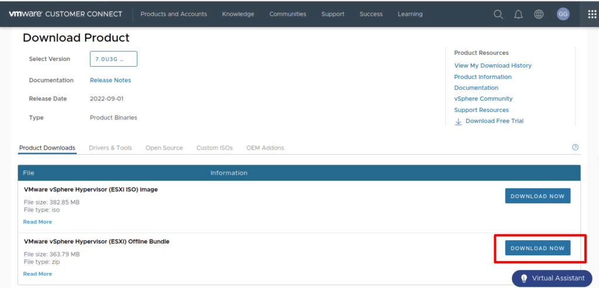](images/image-2-1024x493.png)

<figcaption>

ベースイメージ

</figcaption>

</figure>

<figure>

[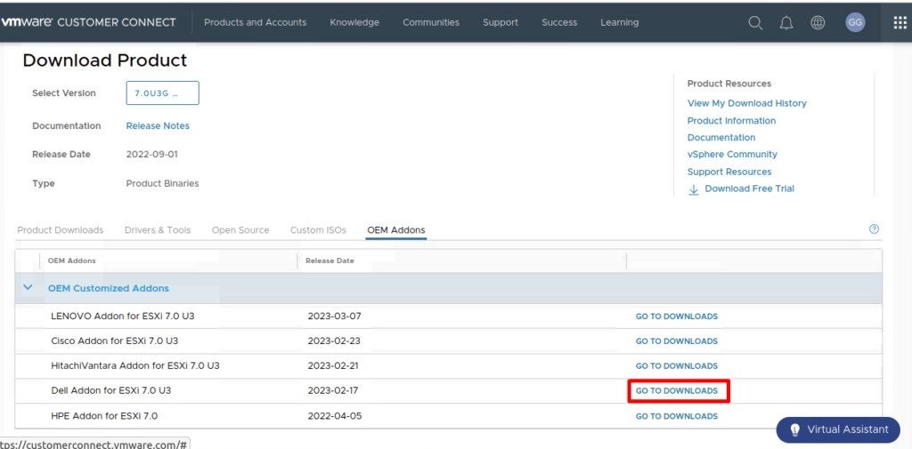](images/image-3-1024x505.png)

<figcaption>

アドオン（ここではDell を選択）

</figcaption>

</figure>

vCenter にログインし（ここでは7.0U3 を使ってます）、Lifecycle Manager のメニューを選択します。vCenter がインターネット接続がされていれば、自動的にベースイメージやアドオンが取得されますが、接続されていない前提で、先ほどダウンロードしたベースイメージとアドオンをそれぞれインポートします。

<figure>

[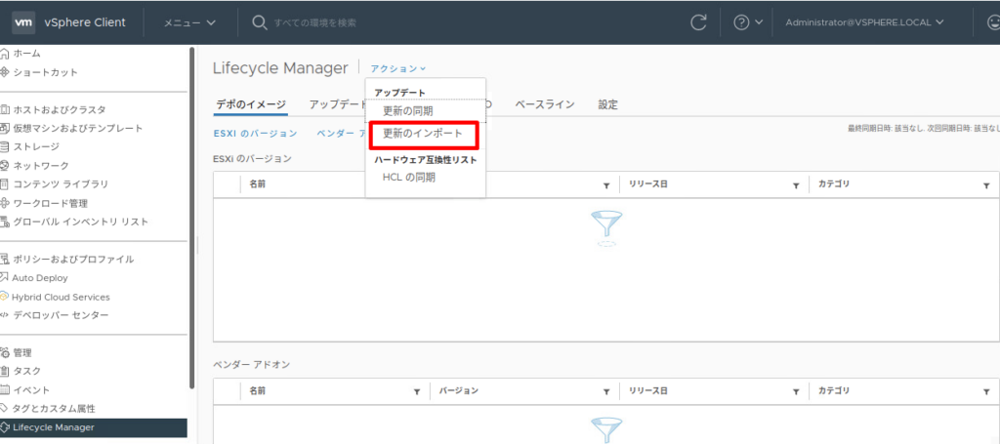](images/image-4-1024x455.png)

<figcaption>

ベースイメージとアドオンの2つのzip ファイルをインポート

</figcaption>

</figure>

[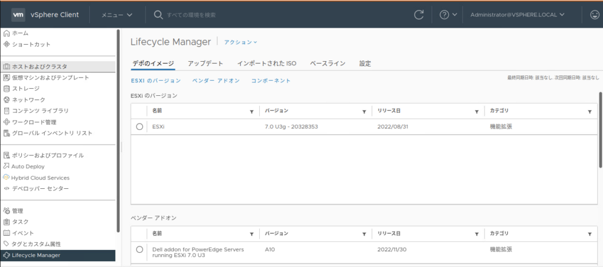](images/image-5-1024x454.png)

その後、空のクラスタを作り、vLCM を有効化します。ここで、先ほどインポートしたベースイメージとアドオンを選択します。複数のベースイメージとアドオンがインポートされている場合は、適切なバージョンを選択します。アドオンにもバージョンがあり、Dell の場合はA01, A02, のようにバージョニングされています。

<figure>

[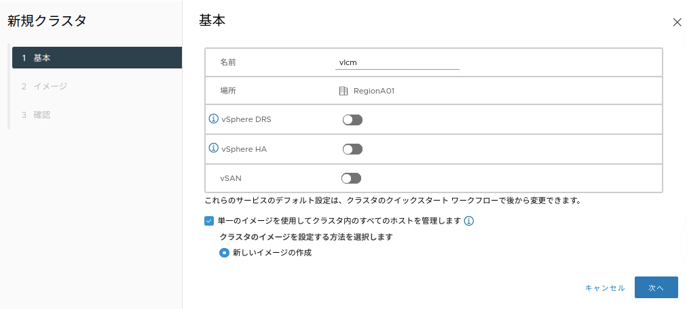](images/image-6.png)

<figcaption>

単一のイメージを使用してクラスタ内のすべてのホストを管理＝vLCM の有効化

</figcaption>

</figure>

[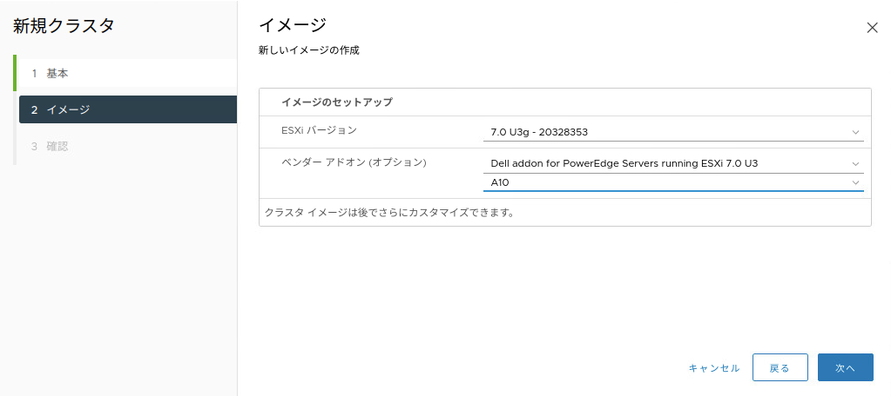](images/image-7.png)

クラスタ作成完了後、イメージのエクスポートを選択し、ISO やzip 形式でダウンロードすることができます。

[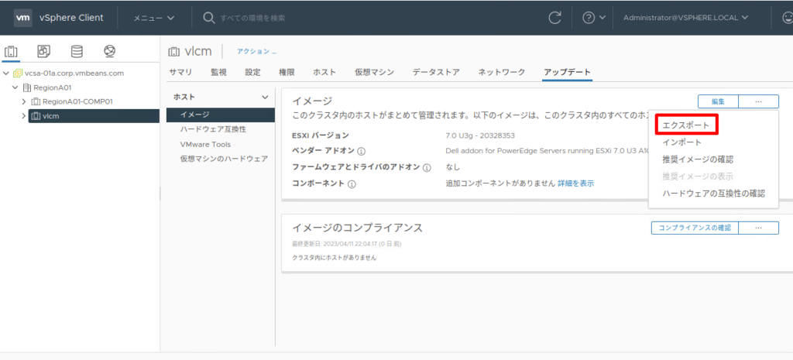](images/image-8-1024x465.png)

[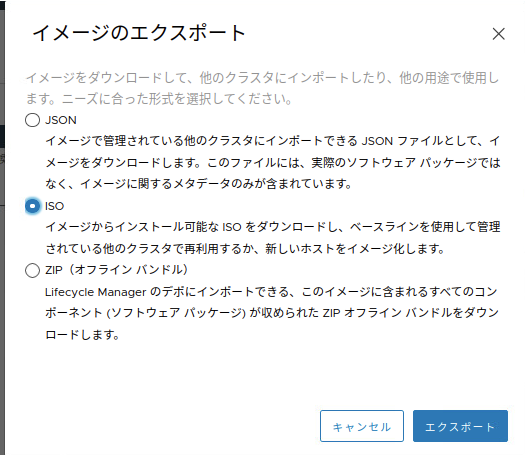](images/image-9.png)

これでカスタムイメージの作成は完了です。「ベースイメージ+アドオン=カスタムイメージ」の関係がより分かりやすくなったのではないでしょうか。とはいえ、この**カスタムイメージ自体は自分で作成する必要はなく、Customer Connect やベンダーのサイトからダウンロードできますので、ベンダー作成のものを使ってください。**

## vLCM 使用時の注意

vLCM は、vSphere8.0 からクラスタ作成時にデフォルトで有効化されるようになりました。

[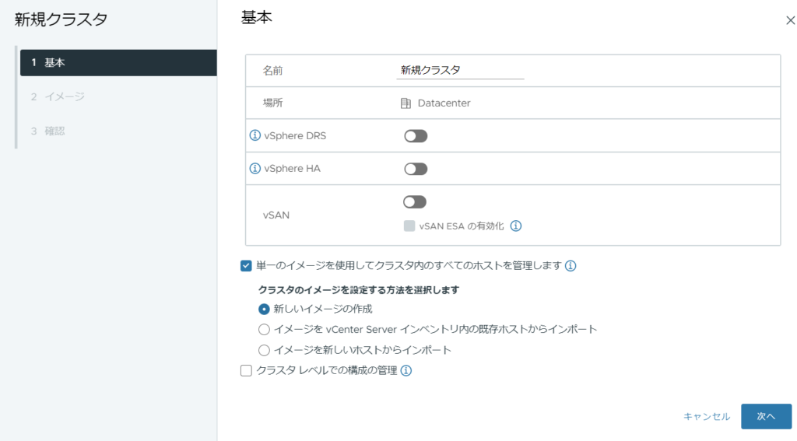](images/image-10-1024x567.png)

  
従来のvSphere Update Manager (VUM) と同様、この機能自体必ずしも使う必要はないのですが、使いこなせるとパッチやアップデートが楽になります。**vLCM を使う大きな障害の1つがいわゆる自動化恐怖症で、特にアップデートのような影響の大きい操作は手動で実施したいと考えるお客様は多いです。**  
一応、VUM と同様、/altbootbank に更新前のイメージが書き込まれるため、ロールバックは可能です（下記KB にはVUM のみ記載がありますが、vLCM も同様にロールバックできました）。

[https://kb.vmware.com/s/article/1033604](https://kb.vmware.com/s/article/1033604)

また、そもそもESXi 自体あまりデータを持つべきではないので（データは共有ストレージに保存、vSAN は例外）、最低限構成情報のバックアップを取得しておけば復旧は可能です。

もう1つ大きな障害はライセンスです。**vLCM 自体はStandard ライセンスでOK なのですが、DRS がないと当然ローリングアップデートができないので、vLCM を真面目に使う場合は実質Enterprise Plus ライセンスが必須と考えてください。**

[https://core.vmware.com/resource/vsphere-lifecycle-manager#sec7466-sub3](https://core.vmware.com/resource/vsphere-lifecycle-manager#sec7466-sub3)

また、Quickboot 対応のサーバーであれば、ホストの修正時間を短縮でき、さらにメモリのサスペンド機能（仮想マシンを他ホストに退避させるのではなく、メモリ上で一時停止）を使えば、ホストのパッチに限りダウンタイムを最小限に抑えることができます。ただ、2023/4/12 現在、このメモリのサスペンド機能の条件がやや厳しく、例えばクラスタ内のホスト上にvCenter やNSX があったりすると修正を完了させることができません。現時点では、複数クラスタを運用しているようなある程度の規模の環境でないとメリットを出すのは難しいと思います。

[https://docs.vmware.com/en/VMware-vSphere/8.0/vsphere-lifecycle-manager/GUID-5AF3C64F-1178-4F1E-B5EC-2882957C6045.html](https://docs.vmware.com/en/VMware-vSphere/8.0/vsphere-lifecycle-manager/GUID-5AF3C64F-1178-4F1E-B5EC-2882957C6045.html)

ちなみに、**実はNested ESXi でQuickboot を実行できます。**興味のある方はメモリのサスペンド機能とともに試してみてください。

<figure>

[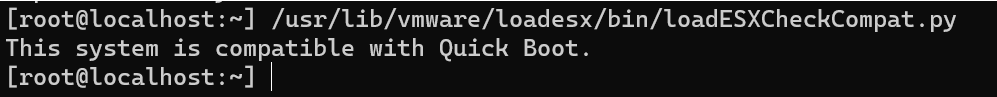](images/image-14.png)

<figcaption>

クイックブートをサポートするかどうかはESXi ホスト内のスクリプトで確認可能

</figcaption>

</figure>

以上の2 つのハードルを仮にクリアしたとして、実際にvLCM を活用しようとすると色々考えることがあります。ここに記載したことが全てではないと思いますが、実際の運用面でのポイントを色々検討してみようと思います。

## 実際の運用について

### 初期インストール

繰り返しですが、**ベースイメージ+アドオン=カスタムイメージ**です。カスタムイメージ作成時にはベースイメージとアドオンを個別にダウンロードしましたが、実際にはそんなことをする必要はなく、Customer Connect またはベンダーのサイトからカスタムイメージを直接ダウンロードしてください。その後、サーバーにカスタムイメージをインストールします。例として、ここではDell のサイトからカスタムイメージ([Dell EMC customized VMware ESXi 7.0 U3 A08 image](https://www.dell.com/support/manuals/en-my/vmware-esxi-7.x/vmware_7.0_icg_pub/dell-emc-customized-vmware-esxi-7.0-u3-a08-image?guid=guid-c85f3e5d-e047-46d1-9697-c10265f3611a&lang=en-us))のiso ファイルをダウンロードして通常通りインストールしました。

### クラスタの新規作成

カスタムイメージインストール済みのホストをクラスタに含め、そこからイメージを抽出します。すると、カスタムイメージなのでベースイメージ（ESXi 7.0U3g）とアドオン（A08）に分解され、イメージとして保存されます。ちなみに、Dell の場合は上記Dell のサイトのビルド番号がベースイメージのビルド番号と一致します（ただしA08 に限りなぜか20328352 と1だけずれています）。

[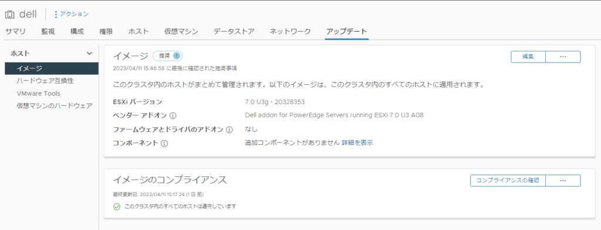](images/image-11-1024x394.png)

### クラスタのイメージの更新（パッチ）

7.0U3e → 7.0U3f みたいな更新をパッチと呼びます。

アドオン自体はベースイメージのパッチと独立して更新することができます。例えば、先のバージョンA08 もベースイメージのバージョンが7.0U3 であれば7.0U3e だろうが7.0U3f だろうが互換性は保たれます。

[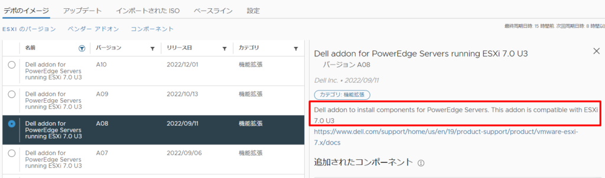](images/image-12-1024x303.png)

ただし、2023/4/12 現在、Dell の場合は7.0U3 だけでもA02-A10 と9 回のカスタムイメージの提供があり、つまり基本的にベースイメージのパッチと同じくらいの頻度でカスタムイメージの更新があります（完全に追従しているわけではありません）。また、カスタムイメージに含まれるベースイメージは同じビルドですが、アドオンのみ修正があるパターンもあります（例えばA08→A09）。

つまり、ベンダーによってこのあたりのポリシーは変わるかもしれませんが、基本的にはベンダー提供のカスタムイメージを使って、定期的にイメージを更新していくことが望ましいと言えます。なぜならば、緊急度の高いパッチであればカスタムイメージがすぐに提供されるはずだからです。ベースイメージやアドオンのみの更新もOK ですが、ベンダー提供のカスタムイメージと揃えた方が何かと安心です（もっとも、これに関しては色々な意見があると思いますし、ベンダーによってはカスタムイメージの提供が遅れる可能性もあります。その場合はCusomer Connect からパッチだけをダウンロードしてベースイメージのみを更新するべきです）。

ちなみに、更新先のカスタムイメージをダウンロードして、それをvLCM にインポートすれば、自動的にベースイメージとアドオンがカスタムイメージから分解されてそれぞれデポに追加されます。

### クラスタのイメージの更新（アップデート）

7.0U1 → 7.0U2 みたいな更新をアップデートと呼びます。

基本的にはパッチと変わりませんが、アドオンとの互換性が生じてきますので、例えば7.0U2 用のアドオンを7.0U3 に適用する、7.0U2 のアドオンを7.0U3 用のアドオンに更新する、みたいなことはできません。必ずカスタムイメージ単位でイメージを更新します。

### クラスタのイメージの更新（アップグレード）

7.0U3 → 8.0 みたいな更新をアップグレードと呼びます。

これはアップデートと同様で、vLCM でもアップグレード可能ですが、機能的に大きな改修があるので、ベンダーの指示がある場合はそれに従います。アップグレードパスには要注意。

なお、環境がプロキシ経由でも構わないのでインターネットに繋げられる場合、推奨イメージという便利な機能が利用できます。これは、現在のイメージから新しいイメージに更新する場合に、互換性を検討した上で最適なイメージを提案してくれる機能です。

[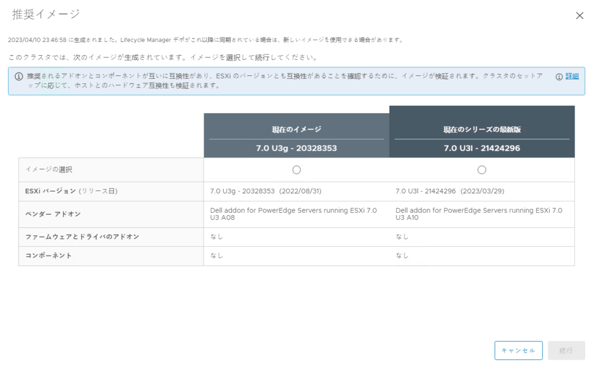](images/image-13-1024x638.png)

### vCenter リストア時

イメージの更新後、障害などのために更新前の状態からvCenter Server をリストアするケースが考えられます。この場合、リストアしたvCenter のクラスタのイメージは更新前に戻りますが、ESXi は既に新しいイメージに更新されています（つまりクラスタで定義したイメージよりホストのイメージが新しい）。この場合にイメージとのずれをvCenter は検知しますが、当然ESXi をダウングレードすることはできないので、クラスタで定義したイメージとホストの実際のイメージの整合性を取るために、クラスタのイメージを新しいものに更新すればOKです（この場合ESXi ホストの更新は実行されません）。

[https://docs.vmware.com/en/VMware-vSphere/8.0/vsphere-lifecycle-manager/GUID-1C23C83A-E6F1-468A-9952-A351A6ABD1B1.html](https://docs.vmware.com/en/VMware-vSphere/8.0/vsphere-lifecycle-manager/GUID-1C23C83A-E6F1-468A-9952-A351A6ABD1B1.html)

なお、今回はファームウェアやConfigration Profile （イメージではなくホスト設定の宣言的定義）には触れておりません。ファームウェアアップデートはベンダーに強く依存してしまうため調べることが難しく、Configration Profile もvSphere8.0 ではまだテックプレビューなので今回は割愛しました。

## 最後に

**アップデートの自動化は、それはそれは怖いものです。**実際、小規模環境であればリスクの方がリターンを上回りますが、規模が大きくなればなるほど自動化を進めていかないと運用が回りません。IT 人材不足が叫ばれて時間が経っていますが、運用を時代に合わせ、恐怖を乗り越えながら自動化を進めていくべきです。

また、今回のvLCM もそうですが、vLCM の自動化は命令型ではなく宣言型です。それゆえ、アップデートのブラックボックスな部分は増えますが、見方を変えれば、それはシステムに操作を任せている、つまり標準化された安心安全な方法でアップデートを自動的に実行してくれることに他なりません。さらに、宣言的であるがゆえに、カスタムイメージの概念が従来よりもわかりやすく、透明性や再現性、一貫性が増し、クラスタで共通ホスト間で予期しない不整合が発生する可能性が減り、結果人為的ミスが減ります。IT 環境が複雑になり、リソースが足りなくなればなるほど、人為的ミスのリスクはもっと考慮されてしかるべきです。（**Kubernetes に対して、まだエクセルで作ったパラメータシートベースの人海戦術で運用しますか？**）。もちろんミスを前提に考えたフェイルセーフな運用を事前に検討するべきですが、併せてインフラにも自動化を積極的に取り入れるべきだと思います。

セキュリティリスクも忘れてはいけません。自動化をしないことはインフラの「塩漬け」に繋がり、インフラの塩漬けはセキュリティリスクに繋がります。

自動化は怖いですが、リターンも大きいです。デフォルトで有効になったvLCM をきっかけに、少しずつインフラ運用の自動化を始めてみませんか？
