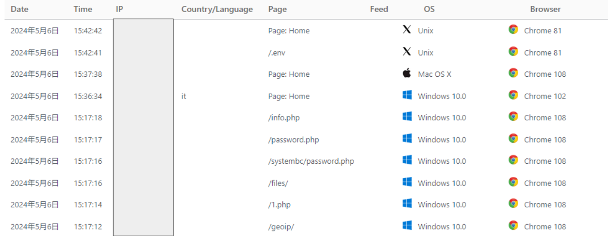
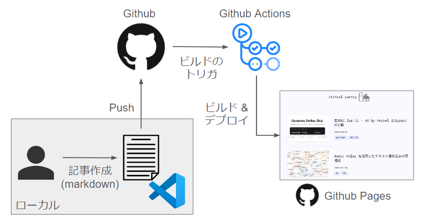

GW の一大イベントとして、これまでWordpress で運用してきたブログのアーキテクチャを思い切って刷新してみました。
まだまだ改善すべき点は多々ありますが、取り急ぎアクセスできるようにはなったので、本記事ではブログの移行にあたって色々感じたことを書き留めたいと思います。

# 移行のモチベーション

以前までは、Wordpress をAWS のLightsail を使って運用してきました。Wordpress を使っていて、下記は魅力として実感していました。

- 誰でも簡単に記事作成ができるお手軽さ
- 豊富なテーマやプラグインによるカスタマイズ性
- シンプルなアーキテクチャ

ところが、かれこれ5年くらい運用をしていて色々な課題が出てきます。

### セキュリティ

思った以上に攻撃されます。ディレクトリトラバーサル攻撃のログが管理画面にたくさん残ります。



### アップデートの大変さ

特にLightsail + Bitnami Wordpress で運用していると強く感じたのですが、Wordpress の環境のアップデートがなかなか難しいです。
運用していると、管理画面に「新バージョンにアップデートしてください」という案内が出るのですが、Bitnami のイメージで作っている場合、イメージの中のPHP のアップデートが単純にはできません。要するにアップデートが面倒なのです。面倒であるため、攻撃されやすいのにもかかわらず、脆弱性対応が遅れてしまうリスクがありました。

### 価格

Wodpress をホストするサーバー代がかかります。しかもAWS の場合、昨今の円安で実質的に大きく値上がりしています。Lightsail の場合、最安のインスタンスで月額約500円、年額6,000円程度はかかっていました。これにドメインの金額やメンテ時のバックアップ代などが追加で発生します。

### 証明書の運用

スクリプトを組んで自動化していたので、これは課題というほどでもないですが、HTTPS 化にLet's Encrypt を使う場合は定期的な更新をしなければなりません。ちなみにスクリプトを組む前までは、「更新のコマンドなんだっけ……」と3か月ごとに繰り返す日々でした。

この中だと特にセキュリティの問題が大きかったので、移行の大きなモチベーションになりました。

# 移行の要件

新しいブログに求める要件としては下記の通りでした。

1. 高いセキュリティが担保されること
2. なるべくシンプルなアーキテクチャであること
3. 記事の作成が簡単であること、特に画像のコピペが簡単にできること
4. バックアップが簡単に取れること
5. これまでのWordpress 環境から簡単に移行できること
6. 価格はなるべく安く、可能であれば無料で運用できること
7. UI はNext.js を使って作成できること

特に重要視したのは、3の画像のコピペと7のNext.js の使用です。私のブログは「スクリーンショットを撮影してそのまま張り付ける」ということが多かったので、これができないとブログの作成時間に大きく影響が出ます。また、Next.js については、最近のVercel の勢いに注目していたので、ブログを単なる記事の公開の場としてではなく、Next.js の練習場にもしたいという目論見がありました。ちなみに後述しますが、**Next.js を使う必要がないのであれば、[Astro](https://astro.build/) を使った方が大分楽だと思います。**

ここで、静的サイトジェネレータ + Headless CMS というおなじみの選択肢が出てきます。実際に途中までは[Strapi](https://strapi.io/) を使って運用するつもりでした。が、そもそも記事ファイルがパブリックになっても私は困らないですし、私以外記事を書きませんし、マークダウン形式であれば記事作成で求める要件は達成できそうなので、わざわざStrapi を使うまでもなく、むしろ使わない方がStrapi のホストにかかる労力も削減できることから、CMS 自体を使わない、というかGithub を使うことにしました。

記事作成については、VSCode を普段エディタとして使っているのですが、VSCode にはマークダウンのための様々な拡張もありますし、[マークダウンファイルに対してそのまま画像をマークダウン形式で貼り付けることも今はできるので](https://zenn.dev/roboin/articles/1fa72705ff2e03)、VSCode + マークダウンで行くことにしました。

最終的には記事をVSCode でマークダウン形式で書き、Github にプッシュし、Github Pages で公開し、Github Actions でビルド、UI はNext.js のSSG で作成、という方法を選択しました。



# Wordpress からの移行

地味に大変でした。いろいろ方法がありますが、私は下記のような流れで進めました。

1. 記事をxml ファイルへエクスポート
2. xml ファイルに対する前処理
3. xml ファイルをマークダウンに変換
4. Next.js の中でマークダウンをjsx/tsx/html に変換

## 1. 記事をxml ファイルへエクスポート

これはWordpress の標準機能なので簡単です。ただ、画像をどうするか問題(画像はURL としてxml に書き込まれるので、画像ファイル自体はダウンロードされない)が付きまとうので、これだけだと完全に移行することはできません。そこで、画像に関してはこの後紹介するwordpress-export-to-markdown のようなスクリプトを使って、xml をマークダウンに変換するタイミングで抽出しました。

## 2. xml ファイルの前処理

私のブログの場合、過去に移行した際に発生したミスだと思いますが、すでに使っていないインスタンスのグローバルIP から画像を読み込んでいたりしてエラーが出ていたので、それをvpantry.com のように書き換えてあげたり、またWordpress のプラグインに依存する記載、例えば一部ページ末尾に表示していた注釈をすべて削除することで、マークダウンへの移行をスムーズに行えるように前処理をしました。

## 3. xml ファイルをマークダウンに変換

変換には[wordpress-export-to-markdown](https://github.com/lonekorean/wordpress-export-to-markdown) を使いました。いい感じにマークダウンに変換してくれるのと、コードブロックなどもきちっと変換した後も残してくれていたので、色々試した中ではこれが一番良かったです。

## 4. Next.js の中でマークダウンをjsx/tsx/html に変換

ここまできたら、後はマークダウンをどうブログとして見せるか、というフロントエンドの問題になります。最終的にはjsx という形式に直さないといけないのですが、最終的には私は[markdown-to-jsx](https://github.com/quantizor/markdown-to-jsx) を使いました。いろいろ方法がある中で、最もシンプルかつカスタマイズ性に優れていたのが選定のポイントでした。

例えば、マークダウンの中ではコードブロックは下記のような形で表現されます。

````text
```python
import numpy as np
```
````

これを自作したコンポーネントに渡して、シンタックスハイライトなどのリッチな表現をしたかったのですが、markdown-to-jsx でも簡単に可能でした。

記事の移行が完了したら、後はフロントエンドを書き、Github にプッシュし、Github Actions でビルドしてGithub Pages で表示するだけです。Github Actions はリリース時には使いづらかった印象ですが、今はテンプレートが充実していて、リポジトリの構成が複雑でなければGithub 側で提案してくれたテンプレートをそのまま使ってビルドできるのでとても楽でした。これが無料であることが信じられません（が、いつか課金されるのではないかと疑ってます）。

# Next.js の問題点

静的サイトジェネレータとして、巷ではAstro が流行っており、Nextra なんかも出てきている中、あえてNext.js を選定したのは私のエゴによるものですが、実際Next.js でブログを作成してみて苦労するポイントが多々ありました。その中でも2つ、特に苦労した点として、ディレクトリ構成と画像の最適化という問題がありました。

## ディレクトリ構成

現在の私のディレクトリ構成は下記のイメージです。

```text
project/
    ├──app/
    ├──public/
    ├──components/
    ├──posts/
        ├── {year}/
            ├── {title}/
                ├──index.md
                ├──images/
                    ├──image-1.png
                    ├──image-2.png
            
```

つまり、Next.js プロジェクトのルートディレクトリにposts ディレクトリを作り、その中で記事ファイルindex.md を管理しています。また、記事中の画像を、記事と同じディレクトリにあるimages フォルダ内で管理したいという要望がありました。これ自体は一般的な要望かと思いますが、Next.js の制限として、画像のような静的なコンテンツはpublic ディレクトリに配置しなければなりません。したがって、このようなディレクトリ構成は通常のやり方では不可能ということになります。

そこで、普段はposts 配下で画像を管理しますが、ビルドのタイミングで画像をpublic ディレクトリにコピーするというかなりの荒業を使っています。

https://zenn.dev/uttk/scraps/d32b33dbc8f88b

正直あまり美しくないので、この時点でNext.js のSSG をブログに使うのは個人的にはお勧めしません。

なお、このあたりの議論は下記サイトを大変参考にさせていただきました。

https://mmazzarolo.com/blog/2023-07-30-nextjs-mdx-image-source/

## 画像の最適化

Next.js ではImage コンポーネントを使い、画像の最適化、例えばデバイスごとのサイズの調整などを行います。SSG ではImage コンポーネントは使えますが、デフォルトでサーバー側でこのような処理を行うため、カスタムローダーを使う必要がありますが、その場合はCloudinary などのサードパーティのプロバイダに画像をホストしてプロバイダのAPI を利用する必要があります。

https://nextjs.org/docs/app/building-your-application/deploying/static-exports#image-optimization

そんなことはしたくないのですが、画像の最適化は諦めたくないので、今回は [Next-Image-Export-Optimizer](https://github.com/Niels-IO/next-image-export-optimizer) を使うことにしました。

そのような経緯を経て、プロジェクト内のnext.config.mjs が大変汚くなるというシンプルさに反するという問題がありますが、これはNext.js の制限として甘んじて受け入れることにしました。

# 移行を終えて

最後に、移行を終えて感じたメリットとデメリットをまとめます。

### メリット:

**運用費の削減**

年額6,000円以上かかっていたサーバー代が無料になりました。また、サーバーのアップデートや証明書の更新もする必要がないため、それらの運用コストを削減することができました。

**カスタマイズ性の向上**
  
Wordpress も自由度は高かったですが、Next.js にしたおかげで更に自由度が高まりました(その一方でやらなければならないことも増えたのですが)。

**記事を書くスピードの向上**

体感2割程度早くなりました。Wordpress の場合、ブロックの場所をクリックしてリストを作って……というように書き始めるまでワンテンポ遅れていたのが以前から若干のストレスだったのですが、マークダウンにすることで、記法の知識さえあれば段落をすぐに作成することができるようになりました。

### デメリット:

**すべてが公開される**

Github で管理している以上仕方のないことですが、ブログを構成するあらゆるものが公開されますので、例えば非公開の記事なんかは作れなくなります。コミットログにも気を配る必要があります。この辺はCMS を使う1つのメリットでしょうか。炎上には気を付けなければなりません。

**アクセス解析が難しい**

google analytics などを使えばできると思いますが、Wordpress のプラグインを使ったアクセス解析がとても良かったので、そのようなことをGithub Pages でも実行するのは骨が折れそうです。

**記事作成後、公開までのスピードが遅くなった**

Github Actions によるビルドの時間がかかりますので、記事作成後、公開するまでに1-2 分程度時間がかかるようになりました。もっとも、プレビュー自体はローカルですぐにできますので、そこまでデメリットとは感じていません。記事が今後増えてきて、ビルドに大きく時間がかかるようになったら対策を検討します。
