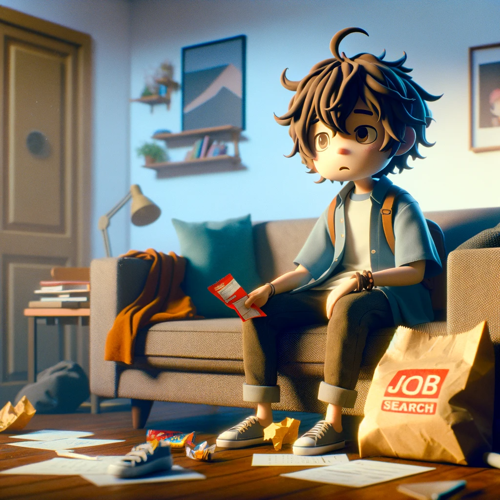

一身上の都合により、新卒入社以来およそ7年弱勤めたVMware という会社を退職しまして、しばらくの間無職をすることになりました。

このブログ自体は、日ごろの業務の上で例えばお客様やパートナー様からの技術的な問い合わせに関して調べた内容の紹介を中心に、そのほか個人的な趣味の範囲における技術的な情報のアウトプットの場として活用していました。が、退職したことにより今後はより後者の、個人的な趣味の範囲においての技術情報のアウトプットの場として使っていこうと思います。

そしてこの記事はおそらく自分にとっては最初で最後の技術以外の内容になると思います。

## なぜ退職したのか？

（「この時期の退職＝Broadcom 社の買収の影響」という回答が容易に想像できるわけですが）退職エントリみたいなものはいろいろ面倒なので書きたくないですが、要するに無職を始めるうえではとても都合の良いタイミングでした。また、VMware という会社は自分にとっては成長させてくれたとても良い会社でした。

ただ、後にも先にもあの**買収前後のドタバタ劇は一生の思い出になると思います。**これはほんとに経験してよかった。

## なぜ無職なのか？

職がないからです。というのは半分冗談で、2024年1月中旬に退職したのですが、特に転職活動もしていません。ありがたいことに、これまでの貯金と退職金と失業給付のおかげでしばらく生活はできそうですが、今後はやよい軒に行く頻度を下げるなどの対策が必要になります😢

もともと無職になることを考えてはいたのですが、ちょうど買収と重なったことで無職を始めるには色々と都合がよかったからというのが理由として大きいです。

## 無職で困らないのか？

金銭面以外でいうと、ちょっとした恥ずかしさはあります。例えば退職してから区役所やハローワークなどに通うことになるわけですが、無職ということを自分から口頭で伝えたり、Web サイトの会員登録時の職業記入欄に無職と書いたりすることにはまだ慣れないです。**最近は「キャリアブレイク」というかっこいい呼び方ができたので、積極的に使っていこうと思います。**

## 無職で不安はないのか？

あんまり考えていません。就職前、自分は基本的に会社で働けない人間だと思っていましたが、周りの人に助けられつつ7年弱も続けられたことで、そしてありがたいことに多分それなりに評価もしていただいたので、「意外と何とかなる」という自信がついたのが大きいです。

## いつまで無職をするのか？

特に決めていないですが、できれば半年くらいは無職をしていたいです。無職に飽きたら職を探します。

## 無職で何をするのか？

バケットリストという、生きている間にやりたいことリストみたいなのが自分にあり、それを潰しながら、エンジニアとしていろいろ活動していきたいと思っています**（ちなみにバケットリストの2つ目に髭脱毛があったのですが、体質により脱毛不可ということがわかり、さっそくコンプ不可というクソゲーが発生しました）**。

後者の活動ですが、実はすでに色々取り組み始めています。

まず、AI 関連のキャッチアップを進めるために、実は去年から[キカガク](https://www.kikagaku.co.jp/)というところでトレーニングを受講しています。[教育訓練給付制度](https://www.mhlw.go.jp/stf/seisakunitsuite/bunya/koyou_roudou/jinzaikaihatsu/kyouiku.html) を活用したかったのと、お金を払うことでがめつい自分はそれを取り戻そうと頑張るかなと思い、半年ほどのコースを選択しました。内容としてはそこまで難しいことはなく、去年は仕事と両立していたのですが、無職になったことでより積極的にキャッチアップが進むと思っています。並行して、技術書による追加のキャッチアップや機械学習コンペにも顔を出し始めました。こういったことは、業務や業務に関連した勉強と並行するのは時間の関係上難しかったため、無職を選んだ大きな理由です。

次に英語です。英語は苦手なのですが、だいぶ前に本田圭佑さんがCM をやられている[プログリット](https://www.progrit.co.jp/)という英語のトレーニング（というかコンサルサービス）を受講したことがあり、そこで学んだ方法論をそのまま今でも時間をとって実施しています。加えて、自分は勉強方法を技術で何とかするのが好きなので、AI と英語学習を組み合わせたアプリ開発をしています。無職になってから英語学習に割ける時間が多くなったのはうれしいです。

また、技術のインプットだけではなくアウトプットもしていきたいです。

このブログは今後も続けていこうと思います。ただし、内容についてはこれまでのVMware 中心というよりは、その時自分が興味を持っている技術が主なトピックになると思います。

あと、ブログでいうと、秋葉原の[Geek Library](https://www.geeklibrary.jp/) というコワーキングスペースを日ごろ活用しているのですが、縁がありまして、そこの技術ブログをちょくちょく書き始めています。

[https://www.geeklibrary.jp/counter-attack/](https://www.geeklibrary.jp/counter-attack/)

この技術ブログは依頼されたトピックについて書いていく、どちらかというとアルバイトのような感じです。早速1つ記事を書いたので宣伝しておきます。「ぽにたろう」という名前で月に2-4 本くらい書くと思います。良ければ覗いてみてください。

https://www.geeklibrary.jp/counter-attack/plantuml/

アウトプットをさらに増やしていくために、ハッカソンのような場への挑戦回数を増やしていきます。内容次第ではあるのですが、目標としては2か月に1回くらい参加したいです。去年初めて会社のハッカソンに参加し、その熱が冷め切らぬ中 [ElevenLabs](https://elevenlabs.io/) のハッカソンにも参加し、自分にとってはとても勉強になった経験がありまして、エンジニアとしての実力を試せるアウトプットの場としてはすごくよかったので、無職になった今積極的に挑戦していきたいです。

そのほかチャレンジしたいことはたくさんあるのですが、AI、英語、アプリ開発、後は新技術を中心にいろいろと楽しみながらキャッチアップしていくことが無職の私の当面の目標です（あと実はほかに株式投資という人生を懸けた趣味があるのですが、今回は割愛します）。

## カッコつけたこと言ってるけど実は何もできないのでは？

耳が痛いです。ただ、自分は**目標がないと無職はマジで辛いことが判明しました。休暇も含めると約1 か月無職をしたのですが、その間に4回昼夜逆転しました。**昼夜逆転しすぎてせっかくの旅行先で昼寝するくらいには生活リズムが狂います。

在職中は仕事がある意味適度なプレッシャーとなり、健康面に役立っていましたが（もちろんストレスも溜まりますが）、無職の間は強制的なアウトプットの場を自分から作ることで、健康的な生活を維持しつつ、エンジニアとしての感覚を鈍らせないようにしたいです。

## まとめ

誰の役にも立たない自己満足になりがちなので、あまりこういった記事を書くのは好きではないのですが、退職という久々に面白いネタができたのと、これ以上昼夜逆転はしないという決意表明の意味でも記事として書いてしまいました。二度と書きません。
