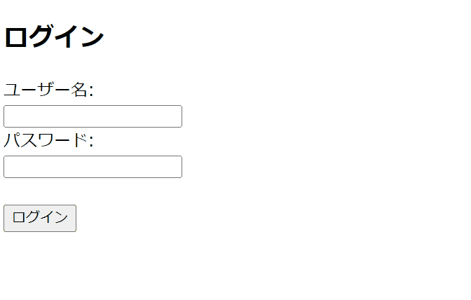
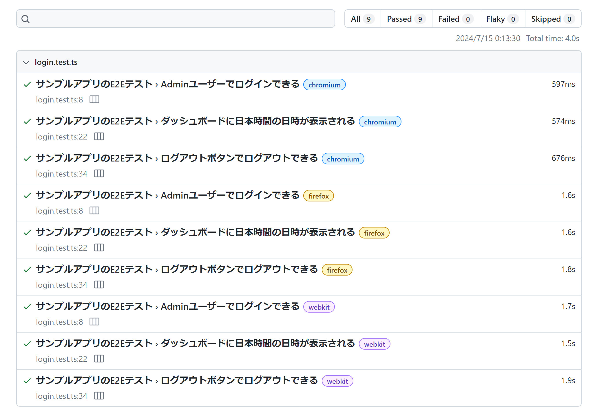
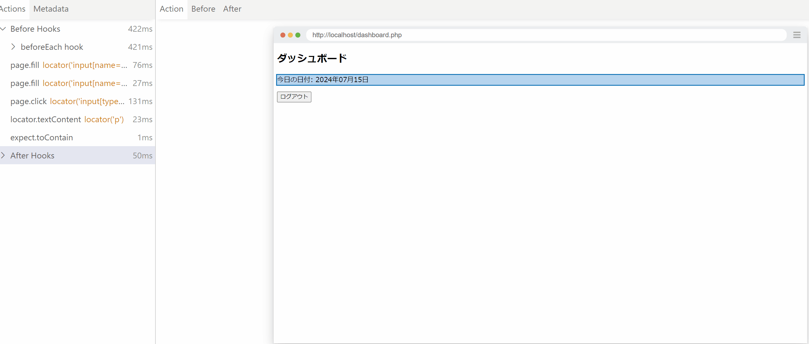
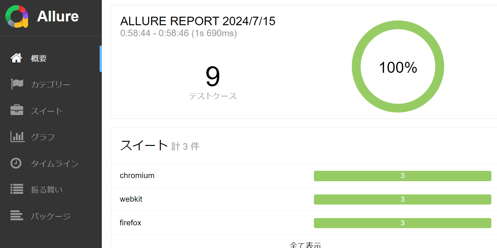

縁あって5月からとあるベンチャー企業でエンジニアとして仕事をしています。転職前は外資のソリューションアーキテクトという製品販売のためのプリセールス的な仕事がメインでしたが、今は以前より手を動かす仕事になりました。自社製品の開発、ITインフラ周りやアライアンス、社内IT 的なことも担当したりと、いわゆるフルスタック的な何でも担当エンジニアとして仕事をしています。

ところで、外資のプリセールスやソリューションアーキテクトは、自社製品を売る、活用してもらうための、ある意味エンドユーザーに夢を与えつつ技術を使って現実的な落としどころを探る仕事です。転職後はソリューションの提案先となるエンドユーザー側にいるわけですが、そのような実際の現場の事情はかなり異なります。特に、ベンチャーならではの急激な成長とそれに伴う痛み、リソース不足や属人化といった様々な課題がリアルなものとして大量に降りかかってきます。そしてそれらの課題は複雑に絡み合っていて、銀の弾丸的な解決方法は存在しません(軽々と「ソリューション」という言葉を使えなくなりました)。

そのような状況の中、現職で抱えているクリティカルな課題の1つでもある製品の品質や生産性といった側面に、個人的な興味もあり最近は注目しています。ということで、本記事ではそのプロセスの暗中模索な状態の共有と、結局のところテストがとても重要じゃない？ということでE2E テストツールのPlaywright の紹介をします。

# まず何からはじめるか？

私が好きな本に[「The DevOps 逆転だ！究極の継続的デリバリー」](https://www.amazon.co.jp/dp/B00MGGW9MI)というDevOps をテーマとした物語があり、できすぎたストーリーではあるものの非常に面白いのでオススメなのですが、本の中では、製品がエンドユーザーに届けられるまでのプロセスを徹底的に可視化して、ボトルネックがどの部分にあるかを特定し、ボトルネックに集中した改善を行っていくような話があります。このストーリーにおけるボトルネックは確かブレントという優秀なSE、つまり属人化こそがボトルネックなのですが、もちろん現場によってそれは様々で、そのようなボトルネックの特定にはまずは「製品のデリバリまでのプロセスの可視化」が最優先で行われるべきだと思います。

そのような本や前職の経験も参考にしつつ、ソフトウェアの生産性や品質の向上のための一環として、まずは以下の流れで進めると良いかなと思いました。これは自社の限りあるリソースの中でなるべくスモールスタートで始められそうなステップのみを記載しています。

1. デリバリプロセスの一連の流れを可視化
2. 各プロセスにおいて時間を算出
3. ボトルネック候補を抽出
4. 抽出したボトルネック候補をさらに深堀して細分化
5. 細分化したボトルネックの解決のためのアイデアを箇条書き
6. 多くのボトルネックに共通した解決策から取り組む

ちなみに、このプロセスの中では1が最も重要に見えますが、実はその前段階のステップ0「人を巻き込む」が存在しており、このステップが最も重要だと思います。なぜなら、このような改善プロセスはチームの協力があってこそだからです。

また、特にステップ4と5では、生成AI が活躍してくれます。デリバリプロセスや優先度は企業によって異なりますが、プロセスに対する深堀や解決のためのブレストは生成AI の得意とするところです。

で、ここからが本題ですが、先のボトルネックの解決において、テストが導入されていない、自動化されていない、もしくはカバレッジが低いのであれば、多くの場合そのような生産性と品質を妨げるボトルネックの解決に「テスト」が関連してくると私は判断しました。アプリケーションの生産性と品質向上においてテストは切っても切り離せないものであり、テストが未熟なのであればプロセス6 におけるボトルネック候補に共通した課題としていずれも「テスト」が浮かび上がってくる気がします。

「気がします」という表現をしたのは、私自信もこれが正しいとは言い切れませんし、自信もあまりないのですが、テストは軽視すべきではないよね、というのは誰しもが思うことだと思いますし、私としては「軽視すべきではない」以上に「最重要である」ぐらいの意識を持った方がいいのかなと思ってます。

# テストは何から始める？

テストといっても色々あります。そしていろいろな企業で色々な用語が使われていて混乱するのですが、単体テストや結合テスト、E2E テストなどいろいろあります。シフトレフトの考え方に基づけば、単体テストのように細かく早期に行われるテストを重視することで、前もって効率的にバグを潰せますし、何よりテストしやすいコードを書く意識こそが、デリバリプロセスにおけるバグ修正のような守りのタスクの流入を抑え、新機能のような攻めのタスクへの注力にフォーカスできるようになります(そう期待しています)。

とはいえ、単体テストが全く導入されていない中でいきなりの導入はめちゃくちゃ難しいです。テストを導入するためにはコードを変更する必要があり、とはいえうかつにコードを変更すると既存の動作への影響が不安で変更できず(そうならないための単体テストのはずなのですが)、鶏が先か卵が先かといった感じになってしまい、ループが発生して脳はショートします。

私もこのあたりはまだ明確な解決策は持っていませんが、まずは取り組みやすい新機能については単体テストができるようなアーキテクチャで実装し、既存のコードは長い時間をかけて徐々にリファクタリングしつつ、並行してE2E などほかの結合度が高いテストを充実させていくのが良いかなと思っています。

で、ここからが(も)賛否両論あると思うのですが、このようなテストの導入にあたり、E2E テストの自動化を先に検討してみようかと考えています。さっきのシフトレフトと言っていることが逆な気がしますが、E2E はテストでやっていることとその効果が誰にとっても分かりやすいという大きなメリットがあります。以下のスライドの通り、E2E を過剰に重視すべきではないという点は同意ですが、テストを導入することは当然既存のデリバリプロセスを変更することになるわけで、当然現場の抵抗が出てきます。そのような現状の変化のメリットを分かりやすく伝え、人を巻き込む際にはE2E テストで実際に効果を魅せることは、とても実用的だと思います。

https://speakerdeck.com/twada/automated-test-knowledge-from-savanna-202406-findy-dev-prod-con-edition?slide=44

ということで、(決して導入しやすいE2E に逃げているわけではないという自戒を繰り返しながら)、最近流行りのE2E テストツールであるPlaywright を紹介します。

# Playwright とは

ざっくりいうと昔(?)のSelenium みたいなWeb アプリのE2Eテストツールです。Chrome, Firefox, Webkit (Safari など) における検証に対応していて、とっても直感的にテストが実行できます。Selenium はどちらかというとブラウザの自動化に重きを当てているのに対して、Playwright は公式サイトの通りテストツールであることを明示しています。コードの分量も少なく済み、パフォーマンスもよく、何よりMS が開発をリードしているということが個人的にはとても信頼できます。

ざっくりとした機能は以下の動画を見てもらえばわかると思います。

https://www.youtube.com/watch?v=1yaqKDHhktI

# 試してみよう

最近php を書いているので、php でサンプルアプリを実装します。ログインフォームと、ログインに成功したら日本時間をダッシュボードに表示しています。

- index.php

```php
<?php
session_start();

$env = parse_ini_file('.env');
$valid_username = $env['USERNAME'];
$valid_password = $env['PASSWORD'];

if ($_SERVER['REQUEST_METHOD'] == 'POST') {
    $username = $_POST['username'];
    $password = $_POST['password'];

    if ($username === $valid_username && $password === $valid_password) {
        $_SESSION['logged_in'] = true;
        header('Location: dashboard.php');
        exit;
    } else {
        $error = "Invalid username or password";
    }
}
?>


<!DOCTYPE html>
<html lang="ja">
<head>
    <meta charset="UTF-8">
    <meta name="viewport" content="width=device-width, initial-scale=1.0">
    <title>ログイン</title>
</head>
<body>
    <h2>ログイン</h2>
    <?php if (isset($error)) echo "<p style='color: red;'>$error</p>"; ?>
    <form method="post">
        <label for="username">ユーザー名:</label><br>
        <input type="text" id="username" name="username" required><br>
        <label for="password">パスワード:</label><br>
        <input type="password" id="password" name="password" required><br><br>
        <input type="submit" value="ログイン">
    </form>
</body>
</html>

```

dashboard.php

```php
<?php
session_start();

if (!isset($_SESSION['logged_in']) || $_SESSION['logged_in'] !== true) {
    header('Location: index.php');
    exit;
}

date_default_timezone_set('Asia/Tokyo');
$today = date('Y年m月d日');
?>

<!DOCTYPE html>
<html lang="ja">
<head>
    <meta charset="UTF-8">
    <meta name="viewport" content="width=device-width, initial-scale=1.0">
    <title>ダッシュボード</title>
</head>
<body>
    <h2>ダッシュボード</h2>
    <p>今日の日付: <?php echo $today; ?></p>
    <form action="logout.php" method="post">
        <input type="submit" value="ログアウト">
    </form>
</body>
</html>
```

- logout.php

```php
<?php
session_start();
session_destroy();
header('Location: index.php');
exit;
?>
```

- .env

```
USERNAME=admin
PASSWORD=password
```



ここで、このアプリのテストケースを考えます。一番簡単なのはアプリのコードや概要を生成AI にぶち込んでしまい、テストケースをAI に考えてもらうことです。とはいえ、このようなシンプルなアプリであれば、以下のようなテストケースが普通に思いつくはずです。

- ログインができる
- 日時が表示される
- ログアウトができる

正常系に限って言えば上記で十分かと思いますが、異常系も含めるのであれば、これにログインの失敗や空文字を入れた時のエラーメッセージの表示などが考えられます。ほかにも追加できる要素はありますが、E2E テストはコストがかかりますので、バランスと運用性を考えながら実装していくことになります。

さて、Playwright でテストを作る場合は以下のようなコードになります。なお、このアプリの場合、日付を表示したりログアウトするための前提条件としてAdmin ユーザーでのログインが必要なため、ログインのテストを省きもう少しシンプルにできます。

```ts
const { test, expect } = require('@playwright/test');

test.describe('サンプルアプリのE2Eテスト', () => {
  test.beforeEach(async ({ page }) => {
    await page.goto('http://localhost/index.php');
  });

  test('Adminユーザーでログインできる', async ({ page }) => {
    await page.fill('input[name="username"]', 'admin');
    await page.fill('input[name="password"]', 'password');
    await page.click('input[type="submit"]');

    await expect(page).toHaveURL('http://localhost/dashboard.php');
    await expect(page.locator('h2')).toHaveText('ダッシュボード');

    const dateText = await page.locator('p').textContent();
    expect(dateText).toContain('今日の日付:');

    await expect(page.locator('input[value="ログアウト"]')).toBeVisible();
  });

  test('ダッシュボードに日本時間の日時が表示される', async ({ page }) => {
    await page.fill('input[name="username"]', 'admin');
    await page.fill('input[name="password"]', 'password');
    await page.click('input[type="submit"]');

    const now = new Date();
    const japanTime = new Date(now.toLocaleString('en-US', { timeZone: 'Asia/Tokyo' }));
    const expectedDate = `${japanTime.getFullYear()}年${String(japanTime.getMonth() + 1).padStart(2, '0')}月${String(japanTime.getDate()).padStart(2, '0')}日`;
    const dateText = await page.locator('p').textContent();
    expect(dateText).toContain(expectedDate);
  });

  test('ログアウトボタンでログアウトできる', async ({ page }) => {
    await page.fill('input[name="username"]', 'admin');
    await page.fill('input[name="password"]', 'password');
    await page.click('input[type="submit"]');
    await page.click('input[value="ログアウト"]');
    await expect(page).toHaveURL('http://localhost/index.php');
    await expect(page.locator('h2')).toHaveText('ログイン');
  });
});

```

テストを実行する際は、以下のようにトレースを有効化すると、各テストのプロセスにおいてスクリーンショットを撮ってくれたりネットワークログを取ってくれたりと至れり尽くせりです(出力されるファイル数やサイズは当然増えます)。Selenium の時はブラウザごとのテストのセットアップがかなり大変ですが、Playwright の場合はnpm/npx でインストールさえしてしまえば自動でChromium/Firefox/Webkit のテストができるので、面倒なテストに対するモチベーションが上がります。

```
npx playwright test --trace on
```



「ダッシュボードに日本時間の日時が表示される」テストケースのトレースを見てみると、どのようなアクションが行われたか直感的に可視化できます。



ちなみに、テストコードを書く際はSelenium のようにブラウザを実際に操作してキャプチャすることもできます。キャプチャしたテストコードは汚くなりがちなので、生成AI を一段階かまして生成されたテストコードのリファクタリングをしてあげるといい感じです。

https://playwright.dev/docs/codegen-intro

# レポート生成

Playwright をCI にいきなり組み込むのはハードルが高いです。MS 主導ということもありGithub Actions との連携がドキュメントに記載されていたりするのですが、別にCI に組み込むのは必須というわけではなく(自動化を進めていくならいずれCI に組み込むことになりますが)、Playwright によるE2E テスト自動化の効果をチームに浸透させていく最初のきっかけとして、テスト結果の可視化であるレポート機能は非常に有効です。

デフォルトでは先に共有したようにHTML ファイルでのgithub みたいなUI でレポートが生成されますが、他にも以下ドキュメントのように様々な形式でレポートを作成できます。

https://playwright.dev/docs/test-reporters

各レポートの詳細は以下のブログにまとまっています。

https://daipresents.com/2024/02/22/playwright-reporter/

外部パッケージのAllure を使うと、イケてる感じに可視化してくれます。



ただ、個人的にはわざわざAllure を使うよりも、デフォルトのHTML レポートの方が見やすいと感じました。

# まとめ

本記事ではテストについて今思っていることをいろいろ書いてみました。私自身まだまだソフトウェアエンジニアとしての経験が少ないため、頓珍漢なことを書いている気もしますが、ソフトウェアの品質や生産効率の向上について考えれば考えるほど、なぜかいつの間にかテストの話に帰着している気がします。そしてテストについて調べれば調べるほど奥が深く、運用可能なテストとしてどのように自社で適用していくか考えるのはとても面白いです。