生成AI の応用領域で、2024年に一気に成長するだろうと個人的に思っているのがUI の生成です。センスのない私にとってUI/UX をどうするかはいつも悩みの種なのですが、最近は生成AI に助けられることも増えてきました。

ただ、少なくとも2024/4/1 現在、生成AI だけでUI/UX をどうにかできるかというわけではなく、むしろまだまだ発展途上感が否めません。特により優れたユーザー体験を追求しようとすると、生成AI はそのアイデア出しには使えるものの、例えばあるコンポーネントをクリックしたときの美しい挙動や、センスのあるアニメーションをコードに落とす、といったところまではなかなか思った通りの実現が難しいです（時間の問題かと思いますが）。

そこで、本記事では、生成AI for UI の二大巨頭？であるVercel v0 (Pro) とUizard を触ってみて、その所感をまとめたいと思います。興味はあるけど課金までは…といった方には参考になるかもしれません。

ちなみに、UI 生成に関してもAI サービスに登録したおかげで、AI 関連のサービスに対する課金状況がひどいことになってます。

- ChatGPT Plus 月額20ドル
- Claude Pro 月額20ドル
- Google Colab Pro 月額8ドル
- Github Copilot 月額10ドル
- Uizard 月額19ドル
- v0 Pro 月額20ドル
- ElevenLabs 月額5ドル

AI のサービスだけで月額おおよそ16000円発生していることになります。これにAPI 課金が別途走るために**月額20000円程度はAI に支払っていることになりますので、やよい軒20回分と考えると血の気が引きます（ここで、1やよい軒を1000円とする）。**

## Uizard とは

[Uizard](https://uizard.io/) は、Figma ととても似ていて、UI のモックを手早く作るためのサービスです。ただ、AI の領域では私の知る範囲ではUizard が先行していて、Figma がプラグインとしてAI 機能をサポートしているのに対して （Anima など）、Uizard はネイティブにサポートしています。

ところで、UI をAI で作るために最低限必要な機能としては大きく2つあります。1. 見た目を生成AI で作る画像生成 2. 作った見た目をコードに落とすコード生成の機能 です。Uizard はどちらもサポートしていますが、2つ目のコード生成がいまいち使いづらいので、私は1つ目の用途にしか使っていません。

### 画像生成機能

[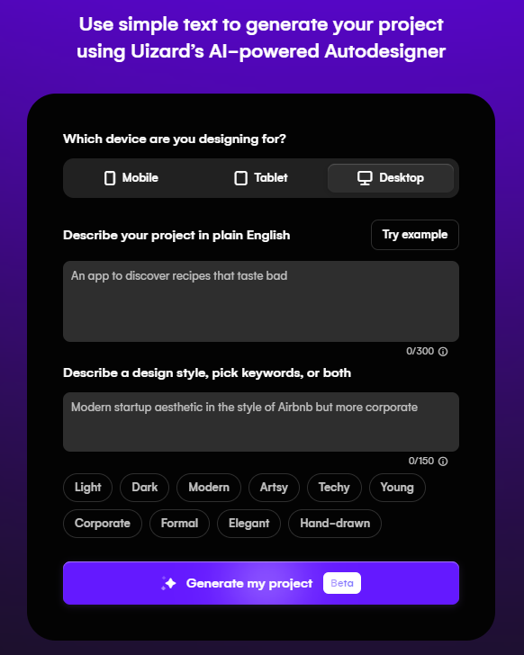](images/image.png)

おなじみ、プロンプトを入力してUI を作ります。プロンプトはデザインのおおもとを決定するものと、デザインのスタイルを決めるものがあり、追加でそのスタイルに対してLight / Dark などのタグを加えます。文字数制限が厳しく、細かくプロンプトを書き込むのはあまり意味がないため（後述）、作成するアプリのテーマと、大枠のデザイン、加えて絶対に必要なコンポーネント1-2 つ、という感じで作ることになると思います。

早速作ってみましょう。入力したプロンプトは下記のとおりです。

**Project Prompt :**

```
Task management application. It consists of two panes: the sidebar and the main part.
The sidebar contains the following menus: 
1. Dashboard 
2. Task Management 
3. Settings 
4. Logout
The main part has a table for task management, and users can add and delete tasks.
```

**Style Prompt:**

```
Simple style for engineers
```

出来上がったものがこちらです。

[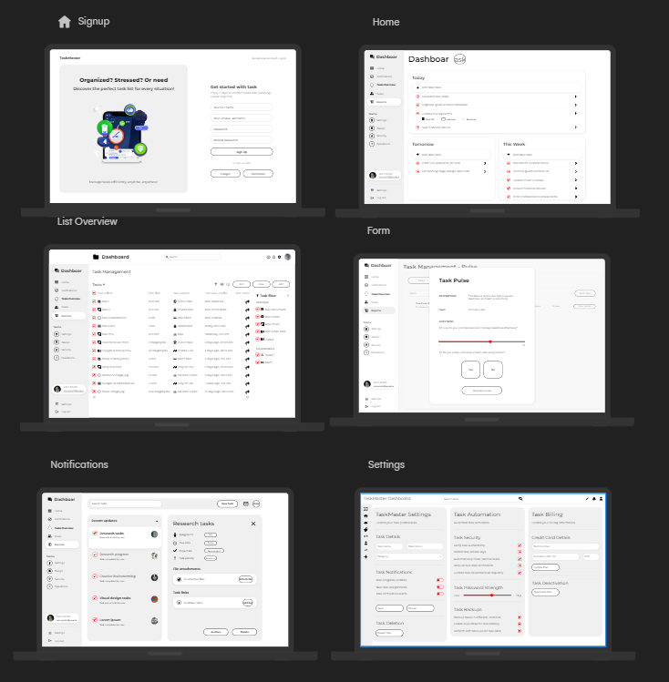](images/image-1.png)

[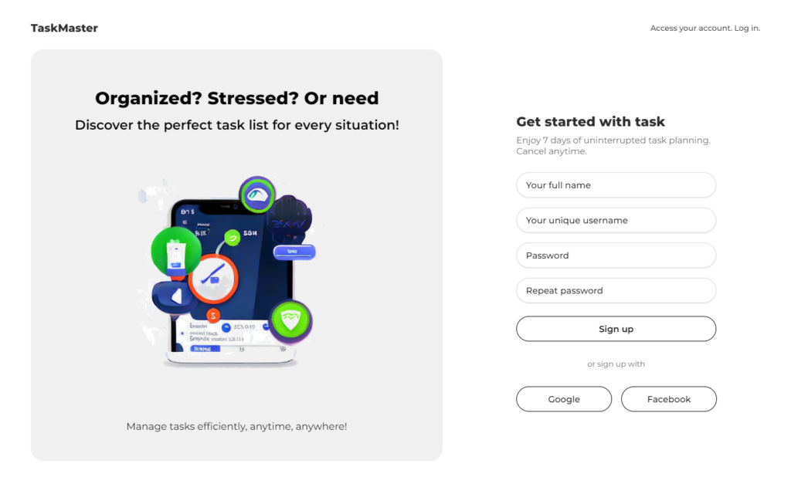](images/Signup-1024x640.png)

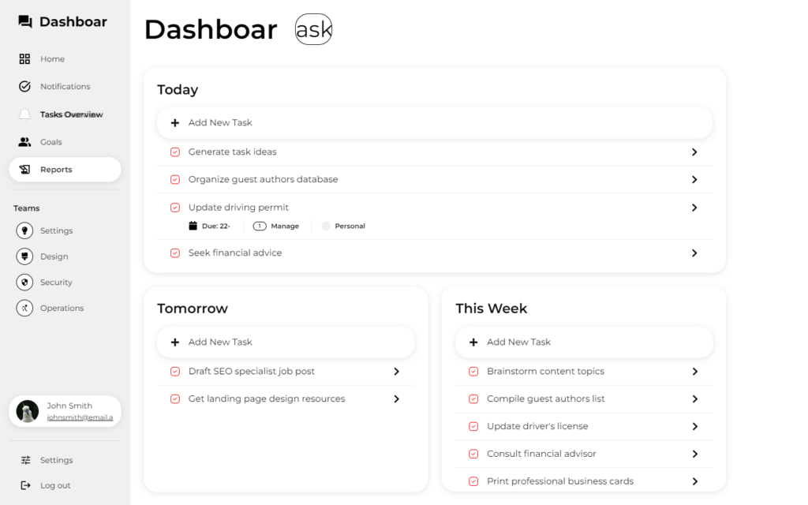

[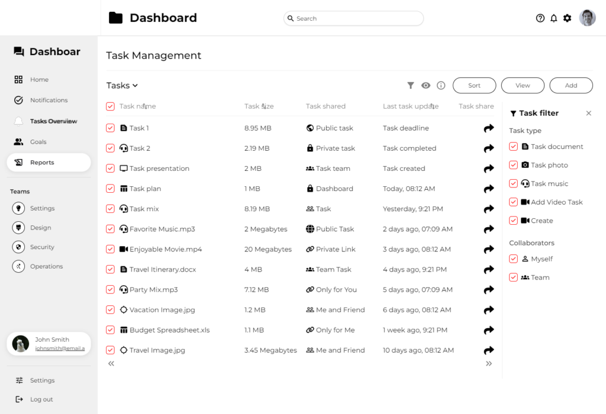](images/List-Overview-1024x700.png)

[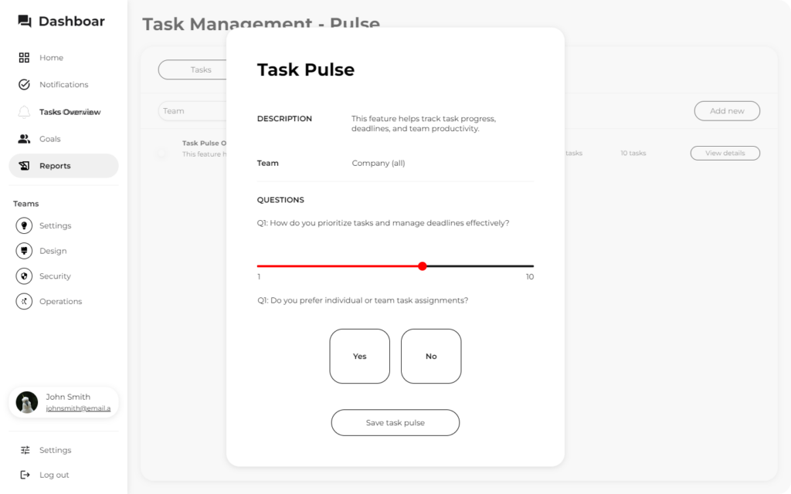](images/Form-1-1024x640.png)

[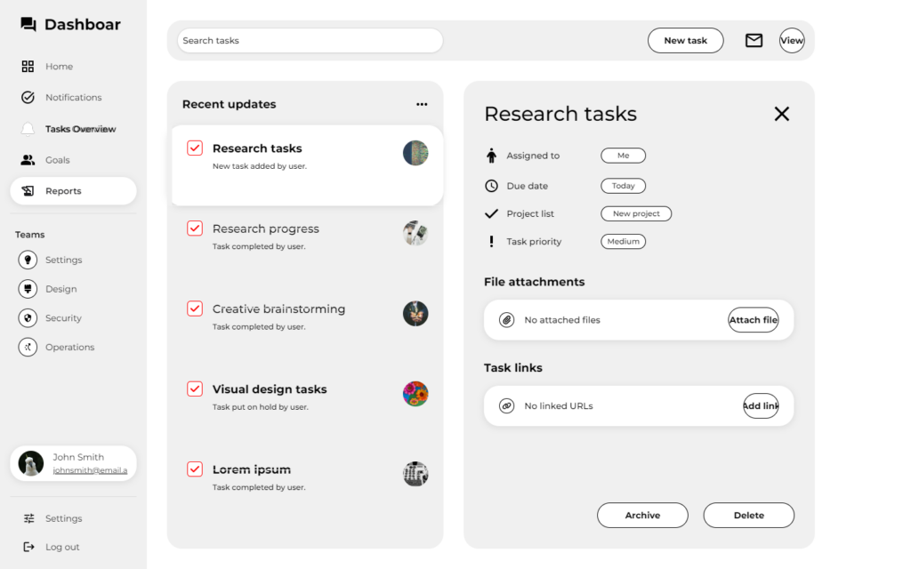](images/Notifications-1024x640.png)

[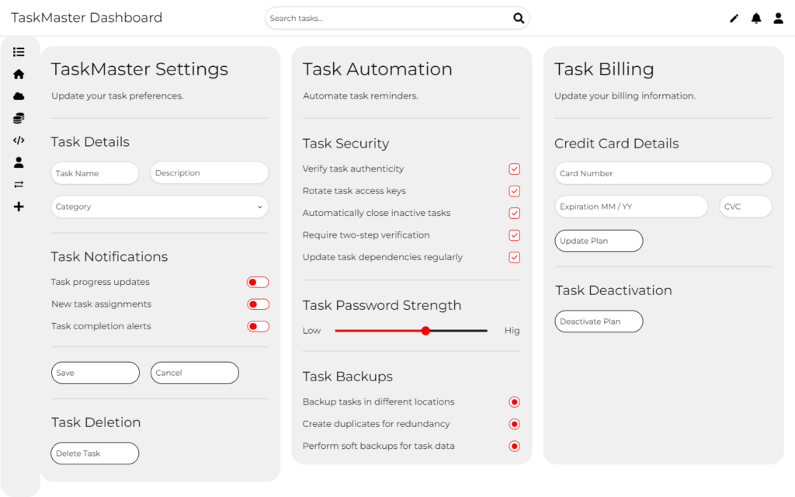](images/Settings-1024x640.png)

いかがでしょうか。サイドバーが意図したものになっていなかったり、Dashboard がDashboar になってたりと細かいところで粗があるものの、比較的UI っぽく作れてはいます。何より、Uizard の強みとして、ログインページから基本的なメニューまで一度に実装でき、AI で後から追加することもできるため、アプリ全体の構成を検討するうえでは役に立ちそうです。

しかしながら、Uizard の課題として、生成されるUI がどれも似たり寄ったり、という点が挙げられます。例えば、先ほどはタスク管理アプリでしたが、今度は以下のプロンプトで株式市場に関するサービスを作ってみましょう。

```
An application for a bird's eye view of the stock market.
```

[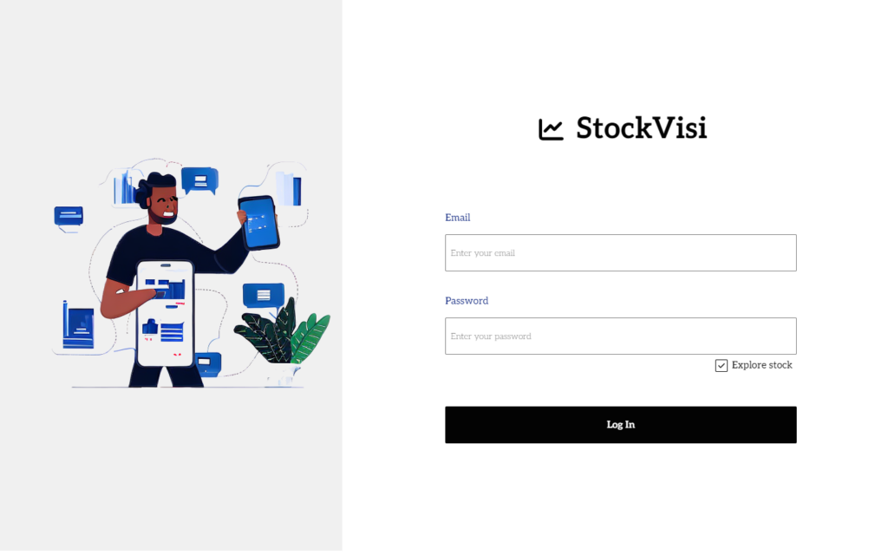](images/Login-1024x640.png)

[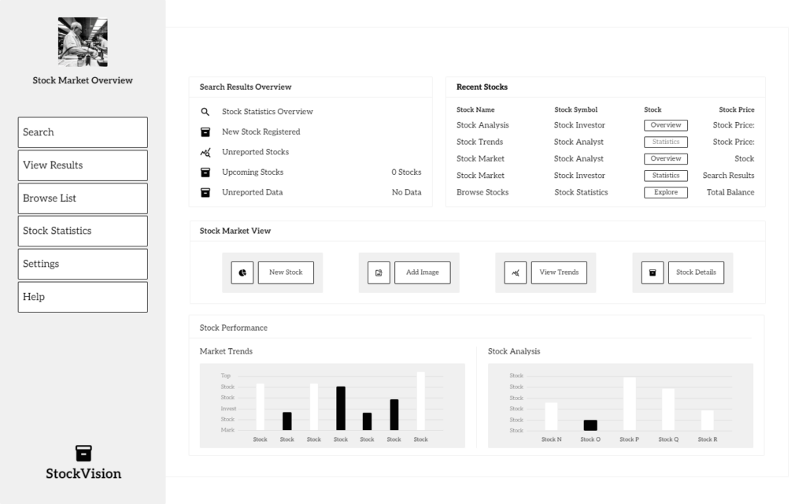](images/Home-1-1024x640.png)

画像は一部ですが、サイドバーは指定せずともできていますし、ログインページに至っては構成がだいぶ似ています。つまり、単なる画像生成ではなく、UI としての画像生成であるが故の制約がかなり強いことが予想されます。

### コード生成機能

React またはCSS 部分の出力が可能です。ただし、作成したページ全体をコードに落とすことはできず、細かくコンポーネントに細分化された状態でのコード出力しかできません。つまり、例えば下記ログインフォームですと、右側のユーザー登録では、フルネーム、ユーザーネーム、パスワード、再確認のためのパスワードの4つのInput フィールドがありますが、1つずつ個別に出力し、すべて同じコンポーネント名で作成されます。当然Tailwind では出力されません。あくまで、最少の単位での出力となります。つまり、このままの状態でコード出力もUizard だけに頼ってしまうと、プロジェクトファイルがかなり汚くなってしまいますし、コンポーネントの配置についても別途自分で定義してあげる必要があります。辛い。

[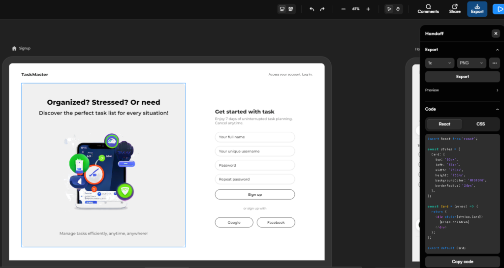](images/image-2-1024x545.png)

ですので、例えば実際にUizard のAI 機能を開発に活用する場合、親コンポーネントを別途作成し、Uizard で出力された各コンポーネントをまとめ、Tailwind を使いたければCSS を生成AI などを活用しながら変換し、親コンポーネント側で配置を決めていく、ということになると思います。これであれば、Uizard 側のコード生成に頼る必要は正直なさそうです。

### 価格

Uizard 自体は無料です。紹介したAI 機能は以前は有料だった気がするのですが（というかそれで登録した）、今確認したら無料のプランでもAI 機能は使えるようです。

[https://uizard.io/pricing/](https://uizard.io/pricing/)

ただし、月に2つしか生成できないため、本格的に試したい場合は月額19ドル（または年間で144ドル）支払う必要があります。あとReact/CSS 出力もPro ユーザー限定のようです。

なお、参考までに、私の場合、**Pro ユーザーとして登録したあとに、サブスクをキャンセルし、Free ユーザーになろうとすると、引き止めのための2か月無料クーポンが発行されました。**これを使えば、1か月分の料金で3か月利用できることになりますが、確実に無料になる保証はないため、参考程度にしてください。

## v0 by Vercel

[v0 by Vercel](https://v0.dev/) はNext.js でおなじみのVercel が開発している生成AI for UI サービスです。無料で始めることができ、React / Next.js との連携もしやすいことから、こうしたライブラリ/フレームワークを活用することが決まっている場合に優れたサービスといえます。また、[shadcn/ui](https://ui.shadcn.com/) とTailwind に依存しているため、もし生成されたUI やコードをそのまま使いたい場合は、この両方も使うことになります。

### 画像生成機能

Uizard と大きく異なる点として、プロンプトを入力すると、Uizard の場合はログインページから実際のメイン部分までが一通り出力されましたが、v0 の場合はプロンプトを再現した1つのコンポーネントで構成されるページが3つ出力されます。これは3つの候補の中から好きなものを選んでくれ、という意味です。

また、Speed / Quality の2つの生成タイプがあります。その名の通り、スピード重視か質重視か、ですが、Quality は課金ユーザー限定であることに注意してください。

早速試してみます。

**プロンプト:**

```
Task management application. It consists of two panes: the sidebar and the main part.
The sidebar contains the following menus: 
1. Dashboard 
2. Task Management 
3. Settings 
4. Logout
The main part has a table for task management, and users can add and delete tasks.
```

**Speed の場合:**

[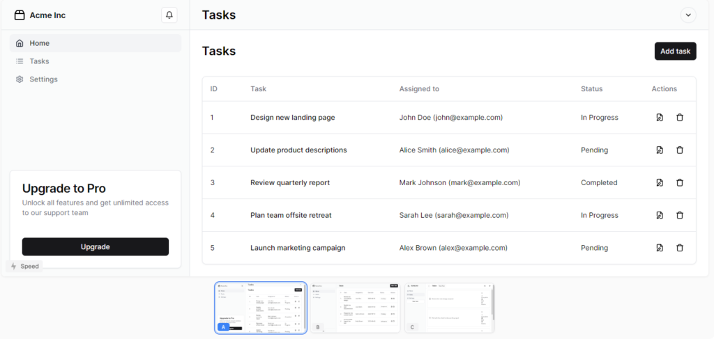](images/image-3-1024x487.png)

[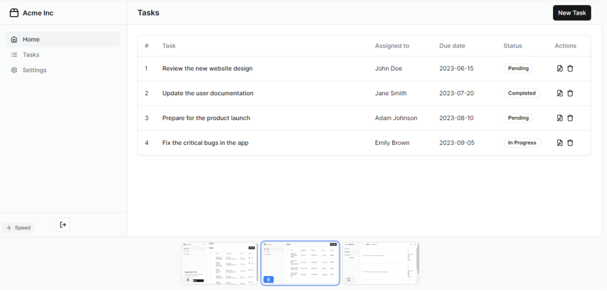](images/image-4-1024x492.png)

[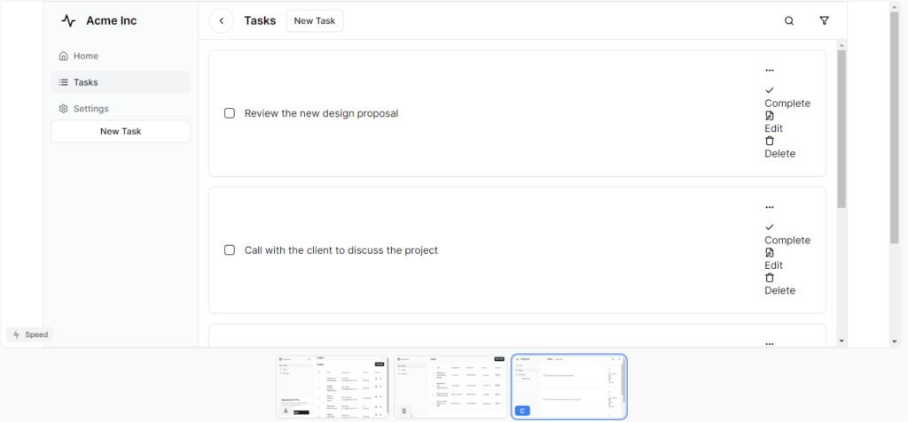](images/image-5-1024x477.png)

**Quality の場合:**

[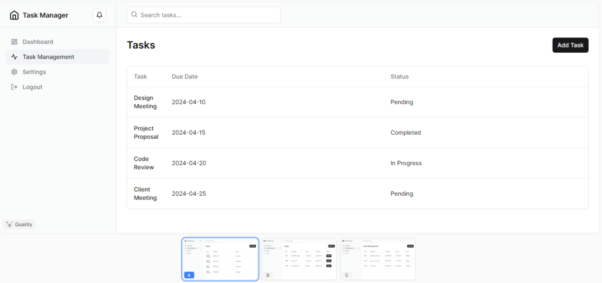](images/image-6-1024x483.png)

[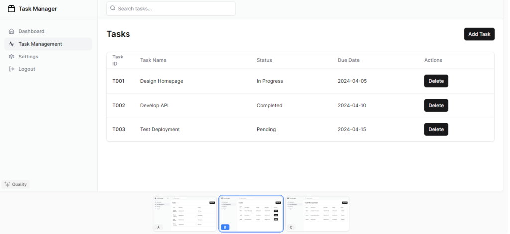](images/image-7-1024x472.png)

[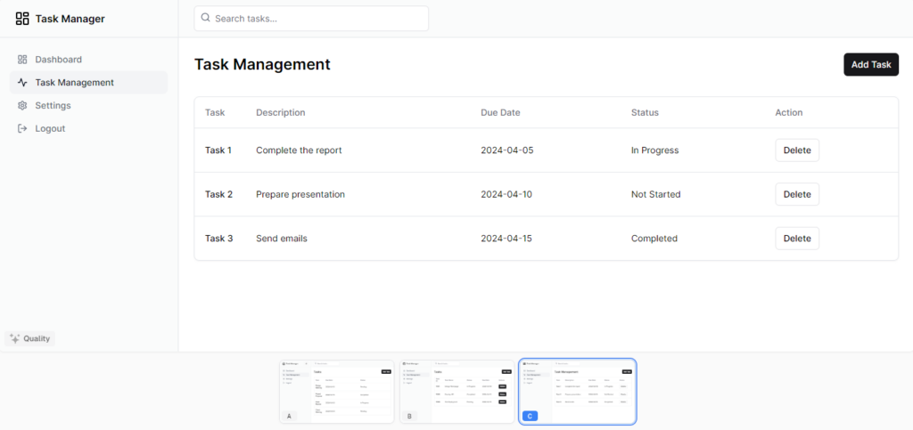](images/image-8-1024x483.png)

特にQuality に注目してほしいのですが、プロンプトで指定したサイドバーの構成、すなわち**Dashboard、Task Management、Settings、Logout の4つのメニューで構成してくれという指示を忠実に再現していることが驚きです。また、Speed では3つ目の候補のように一部崩れたUI が出力されていますが、Quality ではそれもありません。**

いずれもデザインはモダンな白黒のデザインになりますが、プロンプト次第で変更もできます。

また、コンポーネントのタグごとに（例えばdivごとに）後から個別にプロンプトで変更もできるため、例えばテキストのサイズを大きくしてほしい、などの変更も可能です（もっとも、これぐらいはTailwind を直接弄った方が楽ですが）。

### コード生成機能

React またはHTML での出力が可能です。作成したページが丸々1つのコンポーネントとして出力されます。

[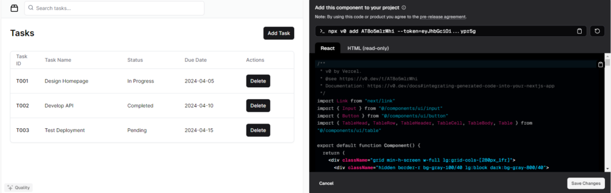](images/image-11-1024x325.png)

```js
/**
 * v0 by Vercel.
 * @see https://v0.dev/t/XXXXXXX
 * Documentation: https://v0.dev/docs#integrating-generated-code-into-your-nextjs-app
 */
import Link from "next/link"
import { Input } from "@/components/ui/input"
import { Button } from "@/components/ui/button"
import { TableHead, TableRow, TableHeader, TableCell, TableBody, Table } from "@/components/ui/table"

export default function Component() {
  return (
    <div className="grid min-h-screen w-full lg:grid-cols-[280px_1fr]">
      <div className="hidden border-r bg-gray-100/40 lg:block dark:bg-gray-800/40">
        <div className="flex h-full max-h-screen flex-col gap-2">
          <div className="flex h-[60px] items-center border-b px-6">
            <Link className="flex items-center gap-2 font-semibold" href="#">
              <Package2Icon className="h-6 w-6" />
              <span className="">Task Manager</span>
            </Link>
          </div>
          <div className="flex-1 overflow-auto py-2">
            <nav className="grid items-start px-4 text-sm font-medium">
              <Link
                className="flex items-center gap-3 rounded-lg px-3 py-2 text-gray-500 transition-all hover:text-gray-900 dark:text-gray-400 dark:hover:text-gray-50"
                href="#"
              >
                <HomeIcon className="h-4 w-4" />
                Dashboard
              </Link>
              <Link
                className="flex items-center gap-3 rounded-lg bg-gray-100 px-3 py-2 text-gray-900  transition-all hover:text-gray-900 dark:bg-gray-800 dark:text-gray-50 dark:hover:text-gray-50"
                href="#"
              >
                <ActivityIcon className="h-4 w-4" />
                Task Management
              </Link>
              <Link
                className="flex items-center gap-3 rounded-lg px-3 py-2 text-gray-500 transition-all hover:text-gray-900 dark:text-gray-400 dark:hover:text-gray-50"
                href="#"
              >
                <SettingsIcon className="h-4 w-4" />
                Settings
              </Link>
              <Link
                className="flex items-center gap-3 rounded-lg px-3 py-2 text-gray-500 transition-all hover:text-gray-900 dark:text-gray-400 dark:hover:text-gray-50"
                href="#"
              >
                <LogOutIcon className="h-4 w-4" />
                Logout
              </Link>
            </nav>
          </div>
        </div>
      </div>
      <div className="flex flex-col">
        <header className="flex h-14 lg:h-[60px] items-center gap-4 border-b bg-gray-100/40 px-6 dark:bg-gray-800/40">
          <Link className="lg:hidden" href="#">
            <Package2Icon className="h-6 w-6" />
            <span className="sr-only">Home</span>
          </Link>
          <div className="w-full flex-1">
            <form>
              <div className="relative">
                <SearchIcon className="absolute left-2.5 top-2.5 h-4 w-4 text-gray-500 dark:text-gray-400" />
                <Input
                  className="w-full bg-white shadow-none appearance-none pl-8 md:w-2/3 lg:w-1/3 dark:bg-gray-950"
                  placeholder="Search tasks..."
                  type="search"
                />
              </div>
            </form>
          </div>
        </header>
        <main className="flex flex-1 flex-col gap-4 p-4 md:gap-8 md:p-6">
          <div className="flex items-center">
            <h1 className="font-semibold text-lg md:text-2xl">Tasks</h1>
            <Button className="ml-auto" size="sm">
              Add Task
            </Button>
          </div>
          <div className="border shadow-sm rounded-lg">
            <Table>
              <TableHeader>
                <TableRow>
                  <TableHead className="w-[80px]">Task ID</TableHead>
                  <TableHead className="max-w-[150px]">Task Name</TableHead>
                  <TableHead className="hidden md:table-cell">Status</TableHead>
                  <TableHead className="hidden md:table-cell">Due Date</TableHead>
                  <TableHead>Actions</TableHead>
                </TableRow>
              </TableHeader>
              <TableBody>
                <TableRow>
                  <TableCell className="font-medium">T001</TableCell>
                  <TableCell>Design Homepage</TableCell>
                  <TableCell className="hidden md:table-cell">In Progress</TableCell>
                  <TableCell>2024-04-05</TableCell>
                  <TableCell className="hidden md:table-cell">
                    <Button className="ml-auto" size="sm">
                      Delete
                    </Button>
                  </TableCell>
                </TableRow>
                <TableRow>
                  <TableCell className="font-medium">T002</TableCell>
                  <TableCell>Develop API</TableCell>
                  <TableCell className="hidden md:table-cell">Completed</TableCell>
                  <TableCell>2024-04-10</TableCell>
                  <TableCell className="hidden md:table-cell">
                    <Button className="ml-auto" size="sm">
                      Delete
                    </Button>
                  </TableCell>
                </TableRow>
                <TableRow>
                  <TableCell className="font-medium">T003</TableCell>
                  <TableCell>Test Deployment</TableCell>
                  <TableCell className="hidden md:table-cell">Pending</TableCell>
                  <TableCell>2024-04-15</TableCell>
                  <TableCell className="hidden md:table-cell">
                    <Button className="ml-auto" size="sm">
                      Delete
                    </Button>
                  </TableCell>
                </TableRow>
              </TableBody>
            </Table>
          </div>
        </main>
      </div>
    </div>
  )
}

function ActivityIcon(props) {
  return (
    <svg
      {...props}
      xmlns="http://www.w3.org/2000/svg"
      width="24"
      height="24"
      viewBox="0 0 24 24"
      fill="none"
      stroke="currentColor"
      strokeWidth="2"
      strokeLinecap="round"
      strokeLinejoin="round"
    >
      <path d="M22 12h-4l-3 9L9 3l-3 9H2" />
    </svg>
  )
}


function HomeIcon(props) {
  return (
    <svg
      {...props}
      xmlns="http://www.w3.org/2000/svg"
      width="24"
      height="24"
      viewBox="0 0 24 24"
      fill="none"
      stroke="currentColor"
      strokeWidth="2"
      strokeLinecap="round"
      strokeLinejoin="round"
    >
      <path d="m3 9 9-7 9 7v11a2 2 0 0 1-2 2H5a2 2 0 0 1-2-2z" />
      <polyline points="9 22 9 12 15 12 15 22" />
    </svg>
  )
}


function LogOutIcon(props) {
  return (
    <svg
      {...props}
      xmlns="http://www.w3.org/2000/svg"
      width="24"
      height="24"
      viewBox="0 0 24 24"
      fill="none"
      stroke="currentColor"
      strokeWidth="2"
      strokeLinecap="round"
      strokeLinejoin="round"
    >
      <path d="M9 21H5a2 2 0 0 1-2-2V5a2 2 0 0 1 2-2h4" />
      <polyline points="16 17 21 12 16 7" />
      <line x1="21" x2="9" y1="12" y2="12" />
    </svg>
  )
}


function Package2Icon(props) {
  return (
    <svg
      {...props}
      xmlns="http://www.w3.org/2000/svg"
      width="24"
      height="24"
      viewBox="0 0 24 24"
      fill="none"
      stroke="currentColor"
      strokeWidth="2"
      strokeLinecap="round"
      strokeLinejoin="round"
    >
      <path d="M3 9h18v10a2 2 0 0 1-2 2H5a2 2 0 0 1-2-2V9Z" />
      <path d="m3 9 2.45-4.9A2 2 0 0 1 7.24 3h9.52a2 2 0 0 1 1.8 1.1L21 9" />
      <path d="M12 3v6" />
    </svg>
  )
}


function SearchIcon(props) {
  return (
    <svg
      {...props}
      xmlns="http://www.w3.org/2000/svg"
      width="24"
      height="24"
      viewBox="0 0 24 24"
      fill="none"
      stroke="currentColor"
      strokeWidth="2"
      strokeLinecap="round"
      strokeLinejoin="round"
    >
      <circle cx="11" cy="11" r="8" />
      <path d="m21 21-4.3-4.3" />
    </svg>
  )
}


function SettingsIcon(props) {
  return (
    <svg
      {...props}
      xmlns="http://www.w3.org/2000/svg"
      width="24"
      height="24"
      viewBox="0 0 24 24"
      fill="none"
      stroke="currentColor"
      strokeWidth="2"
      strokeLinecap="round"
      strokeLinejoin="round"
    >
      <path d="M12.22 2h-.44a2 2 0 0 0-2 2v.18a2 2 0 0 1-1 1.73l-.43.25a2 2 0 0 1-2 0l-.15-.08a2 2 0 0 0-2.73.73l-.22.38a2 2 0 0 0 .73 2.73l.15.1a2 2 0 0 1 1 1.72v.51a2 2 0 0 1-1 1.74l-.15.09a2 2 0 0 0-.73 2.73l.22.38a2 2 0 0 0 2.73.73l.15-.08a2 2 0 0 1 2 0l.43.25a2 2 0 0 1 1 1.73V20a2 2 0 0 0 2 2h.44a2 2 0 0 0 2-2v-.18a2 2 0 0 1 1-1.73l.43-.25a2 2 0 0 1 2 0l.15.08a2 2 0 0 0 2.73-.73l.22-.39a2 2 0 0 0-.73-2.73l-.15-.08a2 2 0 0 1-1-1.74v-.5a2 2 0 0 1 1-1.74l.15-.09a2 2 0 0 0 .73-2.73l-.22-.38a2 2 0 0 0-2.73-.73l-.15.08a2 2 0 0 1-2 0l-.43-.25a2 2 0 0 1-1-1.73V4a2 2 0 0 0-2-2z" />
      <circle cx="12" cy="12" r="3" />
    </svg>
  )
}

```

とても強力なコード出力機能ですが、とはいえデメリットもあります。

1つ目に、生成されるコードは1つのコンポーネントとして出来上がるため、プロンプトの時点でコンポーネントの分け方を吟味する必要があるということです。生成AI for UI というよりは、生成AI for React コンポーネント、と理解したほうがよいです。そのため、プロンプト以外の部分であとからテーブルコンポーネントだけを別ファイルにまとめたい、サイドバーをレイアウトとして切り出したいなどの要望には応えられませんが、それに関しては手動または別でChatGPT などをかませば何とでもなります。いずれにせよUizard と比較すると格段に使いやすいです。

2つ目に、先述したようにshadcn/ui とTailwind に依存するため、例えばMUI を使いたい、などの要望に関しては別途対処する必要があります。

最後に、単体のコンポーネントとして出来上がるため、実際に自分のプロジェクトに組み込む方法を理解しておかなければなりません。先ほどの生成したコンポーネントをどのディレクトリに配置するのか、どのようにさらにコンポーネントに分割するか、どのようなページ遷移をさせるのかなど、当然ながらUI 以外の部分でベースとしてのReact やNext.js の知識が必要です。

### 価格

[https://v0.dev/pricing](https://v0.dev/pricing)

無料でも利用できます。無料ユーザーの場合は、月に200クレジットが配布され、コンポーネントの生成ごとに10クレジット消費します。ただし最初の生成に関しては3候補が出力されますので、30 クレジット消費されます。アプリケーションは1コンポーネントで構成されることはなく、最初のコンポーネント生成を（コンポーネントごとに）多用することになると思うので、生成と修正含めて1コンポーネント50クレジットとすると、現実的には月に4つ程度のコンポーネントが作成できます。

Premium ユーザーになると、月額20ドルかかりますが、月に5000クレジットが配布されます。また、Quality モードの利用や作成したコンポーネントを非公開にできたりします。

## まとめと所感

私はv0 を推します。シンプルなデザインが好きなのと、普通にCSS 書くよりはTailwind 使う方が好みなので、そういった意味でもv0 の方が使いやすいです。

実際の使い方としては、v0 で画面を作った後に、出力されたコードをかなり調整したり、コード部分はChatGPT などで書いたり、アイデアだけ拝借してshadcn やMUI のコンポーネントを使ったりと、完全に生成AI 頼みというわけではなく、必要に応じて使っているという感じです。

一方、Uizard はv0 と比較してアプリ全体の構成を作ることに長けています。そのため、全体構成のアイデア出しの用途においてはv0 よりもUizard を推します。ただ、月額19 ドルの価値があるか、といわれると微妙な気がします。AI 以外にも必要な機能があれば課金するべき、といった感じでしょうか。

v0 の課金については、まずは無料版で試してみるとよいです。使いやすいと思ったら課金を検討します。個人的には課金する価値は十分あると思います（開発の応援という意味でも）。

Uizard のアプリケーションの全体設計とv0 のコード生成機能が組み合わされ、すぐにアプリの動くモックを作ってデプロイできるところまでできれば理想ですが、その理想のタイムラインはたぶんすぐ近くだと思います。
