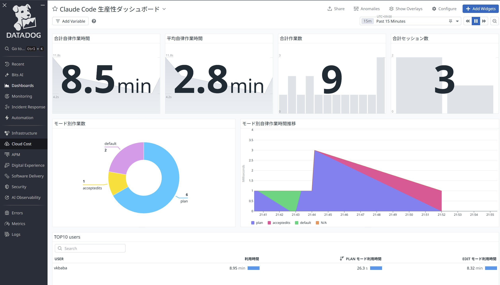

1月に新しくDatadog というObservability の会社に入ったのですが、その前には医療系スタートアップにてアプリケーションの開発をしておりました。その時の社内の開発AI ツールでは、2024年は主にAzure OpenAI (GPT4/4o) を、2025年前半はGemini を使っていました。特にGemini は非常に優秀で、そのおかげで開発を楽に進められるようになりましたが、当時はあまりコーディングエージェントを使っていませんでした。つまり、リポジトリ全体のコンテキストを理解してコードを書くというよりは、途中途中でGemini に聞いてコードを生成、修正していくという感じです。Cursor なんかも話題にはなっていましたが、自分とその時の開発環境にはなかなか合わず、うまく使うことができませんでした。

ところが、**2025年半ばから会社でClaude Code を活用するようになり、Max5x プランを契約、なんやかんやで最終的にMax20x プランを使い、退職する直前までClaude Code を活用した開発とチーム内での定着を進めてきました。**さらには、Datadog に入社して2日目からすでにClaude Code のセットアップを開始し、社内ツールへのMCP 接続、必要なClaude Skills を整備、その結果製品ドキュメントの参照や提案資料の収集、ソースコードの理解やQA 対応、コンテナや仮想マシンの構築やDatadog エージェントのインストールと設定、人事や福利厚生系の情報検索、そして**Windows 派の私には一番つらいMacOS の設定まで、**すべてをターミナルのClaude Code 経由で実現することができ、少なくともAI がない時代に考えられないスピードでオンボーディングを完了することができている気がします。プライベートではMax5x プランを契約し、サイドプロジェクトを進めています (今のところ20x プランまでは契約せずとも事足りています)。

ただ、意外と社内でもClaude Code を使ってる人は少ないようで、開発以外でそこまで使い込んでいる人を見かけません。私もそこまで使いこなしている、とは（Boris のtweet を見たりすると）口が裂けても言えませんが、とはいえ実際に開発スピード15倍、それまでできていなかったテストコードの整備、コードレビュー、ブラックボックスとなっていたコードの深い部分の理解、そして何よりコーディングに対するモチベーションの向上と、様々な定量・定性効果を示すことができ、現職でも今のところ95% 以上の精度でハルシネーションなく一発でドキュメントの情報を検索できています。これは正直異常で、以前までは例えばサポート対象構成かどうかを調べるためにドキュメントを精査するのにそれなりに時間がかかっていましたが（特にsupportable かどうかは間違うとヤバいので）、今はもうOpus4.5+スキルを活用し、95%以上の精度で即答できますし、当然別タブでも並行して作業ができます。

# Claude Code を活用する

こんな素晴らしいClaude Code なのですが、効果をより引き出すために苦労しました。というか、AI エージェント全般に言えると思うのですが、通常のChatGPT やGemini と違って、うまく使うための使い方をある程度学ぶ必要があります。特に重要と感じたのは以下の点です。

**1. Claude.md やスキルなどの仕組みを活用し、コンテキストウィンドウを可能な限りコントロールしながらエージェントの作業のブレを減らす**

**2.  必ずプランニングをしてコンテキストウィンドウを温めてからコーディングを開始する**

**3.  エージェント自身が定量的にタスクの完了を把握するための仕組み（と事前の許可ツールを）整備し、Edit フェーズ開始後のプロンプトあたりの作業時間を最大化していく**

**4.  マルチタブで複数エージェントを起動して開発する**

**特に生産性に一番直結するのが2 で、プランニングができている人とできていない人では、明らかに作業のスピードが異なります。**最初にやりがちなのはChatGPT などと同じように複雑なプロンプトを与えて、一度のプロンプトで精一杯頑張ってもらう方法ですが、これはうまくいかないことが多いです。プロンプト作るのに時間がかかりますし、エージェントの作業がブレて、やりたいことをやってもらえず、そして複数回Edit フェーズを繰り返すうちにコンテキストウィンドウが圧縮され、英語でいきなり回答し始める、ということが起こりがちです（最近言語設定ができるようになりましたが）。

**私はよくコンテキストウィンドウを温めるという表現をしますが**（私が最初に言い始めたと勝手に思っています。どんどん使ってください）、頑張って複雑なプロンプトを作ることはClaude Code での開発では不要で、基本的には最初にプランニングフェーズをちゃんと設けて、エージェントとリポジトリ、そしてやりたいことを含めてちゃんと会話し、何をするかを明確にすることを通して、コンテキストウィンドウに情報を蓄積していきます。そうすることで、ワンショットのプロンプトよりも効果的なプロンプトをエージェントといっしょに作っていく、そんなイメージで進めていくわけです。まさにエージェントにそのプロジェクトのオンボーディングをさせていくわけです。

とまあここまで色々語っているわけですが、今日の本題は、Claude Code を例に、エージェントをちゃんと生産性向上につなげていくためにDatadog で何かできないかという話です。AI ツール導入で難しいのは、導入後ちゃんと結果を出して生産性向上に結び付けられていることを示すことで、これができないとせっかく承認取って導入したのに、うまく扱えず、契約を更新できなかったり、使いこなせる人とそうでない人に差が出てしまい、チーム全体としての生産性向上につながらない、ということが起こってしまいます。

# AI コーディングエージェントの生産性とは？
例えば一番シンプルで計測しやすいのはコミット数やコード行数などが考えられます。実際、前職で効果測定する時にも、コミット数で算出していましたし、Findy の効果測定ツールなんかはPR や変更行数等で見ています。

[https://jp.findy-team.io/blog/ai-casestudy/ai_effectiveness_verification_findy/](https://jp.findy-team.io/blog/ai-casestudy/ai_effectiveness_verification_findy/)

あとは面白いのは削除行数のカウントで、**エージェントは無茶なリファクタリングにも怒らず取り組んでくれるので、**とにかくトライアンドエラーがやりやすく、必然的に全体の削除行数が増え（もちろんその分の追加行数も）、強気にリファクタリングを進められる、という効果もありました。

ただ、例えばPR 数は、AIエージェントを使う場合には適切な指標とは言えないかもしれません。もちろん、Anthropic のようにリソースが潤沢でClaude Code を使いこなし、エージェントの自律駆動割合の高い企業であれば素直にPR 数は増えると思いますが、実際にはPR のレビュープロセスがボトルネックになっている事例が多くあり、また、PR のサイズによっても指標はブレます。さらに、**AI をあまり効果的に使ってないのにAI の効果測定のアピールのためにコミットメッセージにラベルを付けるとか、まったく本質的でないことも発生しそうな気がします（個人の感想です）。**

さらに重要なこととして、PR数やコミット数を計測しても、**チーム全体の生産性を上げるための具体的なアクションにつながらない**という問題があります。「今月のPR数が少なかったね。AI をもっと活用してください。」と言われても、具体的なアクションが見えにくく、改善につながりにくいのではないかと思います。

だとするとどうしたらいいのか、という話ですが、少し前のClaude Code 活用の話に関連して、AI をどれだけ使いこなせているかを指標にするのが面白いんじゃないかと思い、これができると、AI を使いこなせている人の使い方をチームで共有し、チーム全体としての生産性を定量化、そして改善していくことができるのではないかと思います。

そこでDatadog が使えないかという話になるわけです。Datadog のようなObservability ツールは、しばしばモニタリングの延長と表現されがちですが、本質的には**「何かを改善するためのアクションを判断・実行可能にする、アクショナブルな指標を提供するツール」**であり、ということは当然AI の利用の仕方も改善できるはずです。

ここまで長かったですね。

# Datadog を使った生産性ダッシュボードのアイデア



ということで、早速作ってみました。ダッシュボードには以下のようなウィジェットを作っています。なお、plan はわかりやすいですが、承認なしの自動編集モードはacceptedits、承認ありの自動編集モードはdefault と表示されています。

**合計自律作業時間**

Plan 以外の、Edit (Automatic or Manual) フェーズにおける作業時間の合計。長ければ長いほどユーザーの介入なしにエージェントに作業をし続けられている。

**平均自律作業時間**

Plan 以外の、Edit (Automatic or Manual) フェーズにおける平均作業時間。

**合計作業数**

エージェントに依頼した作業の合計数（≒プロンプトの入力数）。

**合計セッション数**

新規で立ち上げたエージェントの数。

**モード別自律作業時間**

フェーズごとに分けた自律作業カウント数。理想を言えば、plan が最も多く、acceptedits が少ないのにも関わらず、自立作業時間が長ければ、よりうまくエージェントを使えているはず。

**TOP10 ユーザー**

Claude Code の利用時間が長いTOP10 ユーザーと、そのPlan/Edit フェーズの使い分けの状態。

ここで、可視化のポイントは、Claude Code のhooks という仕組みを使って、Claude Code のログをjson 形式で保存し、そのログをDatadog エージェントで送信してメトリクスに変換しています。

[https://code.claude.com/docs/en/hooks-guide](https://code.claude.com/docs/en/hooks-guide)

hooks はclaude の各作業の途中でスクリプトを自動実行できますので、それを使ってログを吐いています。hooks のファイルは以下のような実装になっています。

```js
const fs = require('fs');
const path = require('path');
const os = require('os');

const LOG_FILE = path.join(__dirname, '..', 'metrics.log');
const STATE_FILE = path.join(__dirname, '..', '.metrics-state.json');

// state ファイルの読み書き
function loadState() {
  try {
    return JSON.parse(fs.readFileSync(STATE_FILE, 'utf8'));
  } catch {
    return {};
  }
}

function saveState(state) {
  fs.writeFileSync(STATE_FILE, JSON.stringify(state));
}

let input = '';
process.stdin.on('data', chunk => input += chunk);
process.stdin.on('end', () => {
  const eventType = process.argv[2];
  let hookData = {};
  try {
    hookData = input ? JSON.parse(input) : {};
  } catch (e) {
    hookData = {};
  }

  const now = Date.now();
  const sessionId = hookData.session_id || 'unknown';
  let duration_ms = null;
  const state = loadState();

  // prompt_submit 時: 開始時刻を保存
  if (eventType === 'prompt_submit') {
    state[sessionId] = { prompt_submit_at: now };
    saveState(state);
  }

  // stop 時: duration を計算
  if (eventType === 'stop' && state[sessionId]?.prompt_submit_at) {
    duration_ms = now - state[sessionId].prompt_submit_at;
    delete state[sessionId];
    saveState(state);
  }

  const cwd = hookData.cwd || process.cwd();
  const logEntry = {
    timestamp: new Date().toISOString(),
    event: eventType,
    session_id: sessionId,
    permission_mode: hookData.permission_mode || 'unknown',
    tool_name: hookData.tool_name || null,
    duration_ms: duration_ms,
    user: os.userInfo().username,
    project: path.basename(cwd),
    service: 'claude-code',
    ddsource: 'claude-code'
  };

  fs.appendFileSync(LOG_FILE, JSON.stringify(logEntry) + '\n');
});
```

で、上記は実際に叩かれるログ収集用のスクリプトですが、.claude/settings.local.json でhooks を登録することで自動的に実行されます。

[https://github.com/vkbaba/vpantry/blob/main/.claude/settings.local.json](https://github.com/vkbaba/vpantry/blob/main/.claude/settings.local.json)

これで送信の準備は完了で、あとはDatadog エージェントの設定でログのパスを ${PROJECT}/.claude/metrics.log と設定してエージェントを再起動してあげれば (${PROJECT} は任意に変更)、自動的にDatadog 側にログが送信されます。

次に、分析のためにログをメトリクス化します。要するにjson のキーバリューを使ってログを数値に変換します。@event:stop フィルタをかけたログの数がそのままClaude Code のタスク数になりますので、それをカウントしたり、後はduration_time というClaude Code が内部的に作業をしている時間 (ユーザーがプロンプトを入力したりする時間はカウントせず、純粋に手放しでClaude が作業している時間です) をpermission_mode で分けることで、例えばEdit フェーズでどれだけ自律的に作業させることができているかが分かります。


後はそれらのメトリクスをもとに、お好みでダッシュボードを作っていくことになります。実際の運用を考えると、自立作業時間の長いユーザーや、プランモードを使えているユーザー、マルチタブでたくさんClaude を使えているユーザーを、例えばチームのチャンピオンとして定義し、うまく使えていないユーザーとペアプロをセットしたり、勉強会等でインプット/アウトプットの場を作り相互にコミュニケーションできる場をセット、さらには生産性スコアみたいな、単一のバリューでうまく表現できると、それを改善するためのアクションまたはチーム全体として生産性スコアを向上させていく取り組みが定量的にできるのではないかと考えます。

あとは、今回は実施していませんが、**Github とインテグレーションできていれば、このようなClaude Code のメトリクスとPR 数のようなメトリクスを紐づけることができます。**これができると、PR 数とClaude の使われ方を組み合わせて分析することができますので、AI エージェントによる効果測定やその活用のためのフィードバックループが本当の意味で回せるはずです。

# まとめ

本記事では、Claude Code の生産性をDatadog で可視化・改善するアプローチを紹介しました。

**Claude Code を効果的に使うために**

プランニングフェーズでコンテキストウィンドウを温め、エージェントと対話しながら作業を明確化することが重要。

**hooks とDatadog の活用**

 PR 数やコミット数は計測しやすいが、チーム全体の生産性向上につながる具体的なアクションに結びつきにくい。Claude Code の hooks 機能でログを収集し、メトリクス化することで、自律作業時間やモード別の使い分けを可視化。

**チーム改善への活用**

うまく使えているユーザーをチャンピオンとして定義し、ペアプロや勉強会でナレッジを共有することで、チーム全体としての生産性向上が期待できる。

AI エージェントの導入効果を示すだけでなく、「どう使えばより効果的か」をデータドリブンに改善していくことで、チーム全体としての生産性向上につなげていくことができるはずです。そして、真の意味でAI による成果とその継続的な改善を示すことができれば、ビジネス側も文句なしに予算を取ってくれるはずです。